# InfiniteStream

[](https://github.com/jonathaneoliver/infinite-streaming/releases/latest)
[](https://github.com/jonathaneoliver/infinite-streaming/actions/workflows/docker-publish.yml)
[](LICENSE)
[](https://github.com/jonathaneoliver/infinite-streaming/pkgs/container/infinite-streaming)
[](https://github.com/jonathaneoliver/infinite-streaming/stargazers)

A Docker-based HLS/DASH test server for video players. Generates LL-HLS and LL-DASH streams (plus 2s and 6s segment variants) from short VOD content on a shared clock, and lets you inject deterministic, streaming-aware failures — HTTP errors, hung responses, corrupted segments, transport drops, bandwidth limits — on a per-session basis so player bugs become reproducible.

Built for player QA, SDK development, and side-by-side comparison across HLS.js, Shaka, Video.js, native, iOS/tvOS, Android, and Roku. Or for anyone interested in how ABR interacts with content, networking, and players. **Not** a production streaming origin.

Everything is driven by a REST API (the dashboard is a thin client over it), so every fault, every shaping change, every session control available in the UI is also available to test scripts and CI.

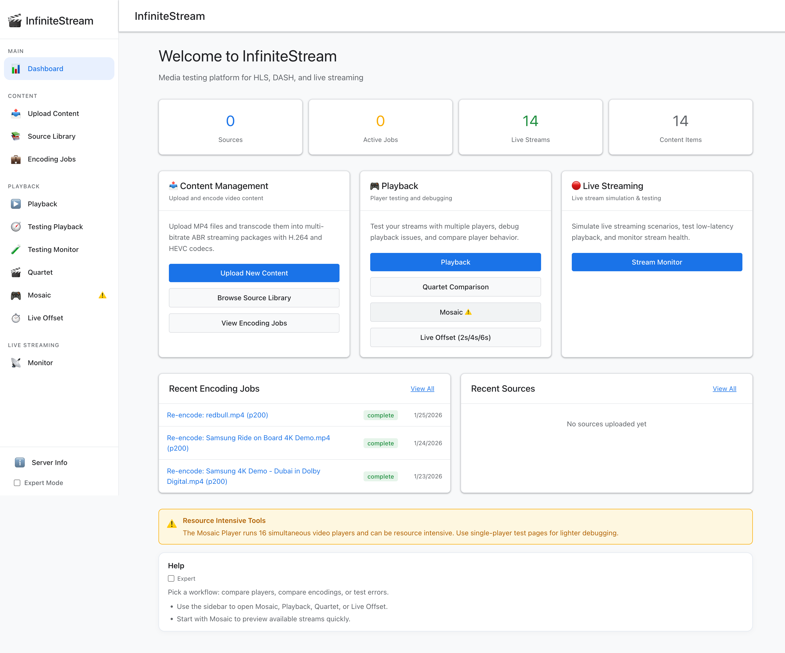

---

## Why you might want this

Player bugs are usually environmental — a network blip, a truncated segment, a slow manifest, a discontinuity the player didn't handle. Reproducing them is the hard part of player QA. Existing options each fall short:

- **Public test streams** (Apple samples, DASH-IF vectors, Bitmovin demos) aren't deterministic, don't loop cleanly, and can't fail on command.
- **Production origins** (Wowza, AWS Elemental, Unified Streaming) are built to *serve* real viewers, not to misbehave on purpose.
- **DIY stacks** (ffmpeg + nginx-vod or nginx-rtmp) take days to wire up and don't give you LL-HLS and LL-DASH from the same clock, let alone a fault-injection UI.
- **Generic chaos tools** (toxiproxy, `tc` alone, Chaos Mesh) are protocol-agnostic — they don't understand segments, playlists, or manifests, so the failures they create aren't meaningful at the streaming layer.
- **Man-in-the-middle proxies** (Charles, mitmproxy) work per-request and per-operator; they don't script repeatable schedules across runs or isolate concurrent testers.

**What makes InfiniteStream different:**

- **Deterministic looping live.** The sliding window moves on a stable clock and wraps on loop boundaries. The same run produces the same timing.
- **All variants from one worker.** LL-HLS, LL-DASH, 2s, and 6s segment variants are generated from a single per-content worker on a shared clock, so cross-protocol comparisons are apples-to-apples.
- **Streaming-aware fault injection.** Inject HTTP errors, hangs, and payload corruption at the segment, playlist, or manifest layer — not just generic TCP faults. The **All** override applies one rule to every HTTP request kind in a single click.
- **Master-playlist manipulation.** Rewrite the HLS master on the fly — strip CODEC / AVERAGE-BANDWIDTH, overstate BANDWIDTH, allowlist specific rungs, change the live hold-back offset. Explore how ladder shape and optional HLS attributes affect startup, ABR, and live-edge latency **without re-encoding**.
- **Transport faults too.** Port-level DROP/REJECT via nftables, composable with HTTP-layer faults.
- **Interactive rate shaping with deterministic patterns.** Drag throughput, latency, loss, and pattern-mode sliders and watch the player react in real time. Or build a step-based throughput pattern with a fixed step duration so the same curve replays bit-for-bit on every run — what you saw rebuffer at 09:14 yesterday rebuffers again today.
- **Per-session isolation.** Each browser session binds to a dedicated proxy port via `player_id`, so concurrent testers don't collide.
- **Streaming-aware HAR.** The dashboard's network-log waterfall annotates each request with what *actually* happened on the wire. A row that looks like a 200 but ended badly is tagged with `!✂` (proxy-injected body cut), `!⏱` (server transfer-timeout), or `!↩` (client gave up), so the chart tells the truth even when the status code can't.
- **Auto-archived session forensics.** Every snapshot and every network request streams into a ClickHouse + Grafana sidecar in real time. The dashboard's **Sessions** picker lists every play of every session for the last 30 days; the **Session Viewer** replays one through the same charts the live page uses, scrubbable to any moment. A "911" button on every player (iOS / iPadOS / tvOS / Android TV) drops a `user_marked` event you can see across charts and pick out from the picker. One-click **bundle download** packages a session's snapshots + HAR + README into a portable `.zip` you can attach to a bug report or replay offline after the 30-day TTL expires.
- **Session grouping for differential testing.** Link two or more independent sessions so fault injection and network shaping apply to all of them simultaneously, while everything else (player engine, codec, live offset, platform, ladder constraints) stays independent per session. One bandwidth collapse, two `live_offset` values, instant apples-to-apples comparison of which setting rebuffers. Or iOS vs Android reacting to the exact same throughput curve. See [Session grouping](#session-grouping-differential-testing).
- **Side-by-side comparison UI.** Mosaic view for watching multiple players or encodings against the same source simultaneously. Quartet (alpha) extends this to four-panel layouts.
- **Accessible to non-programmers.** The whole surface is a web UI — click a fault type, drag a throttle slider, flip a Content-tab toggle, watch the bitrate / buffer / FPS charts react in real time. No Python addons, no YAML, no CLI. A QA analyst, a producer, or a support engineer can run real experiments and see cause-and-effect without writing any code.
- **WYSIWYG sanity check and ABR teaching tool.** Even when your real workflow is headless CI, the dashboard earns its keep two ways. As a confirmation surface: drag the throughput slider, watch the player downshift on the bitrate chart, see the buffer dip and recover — three seconds of eyeballing tells you the fault actually fired and the player actually reacted, and is much faster than parsing a CI log to convince yourself the harness isn't lying. As an ABR teacher: a live `ramp_down` pattern with three time-aligned charts shows you *how* an ABR algorithm thinks — when it commits to a downshift, how long it sits on a rung, what kind of buffer pressure trips it — in a way log scraping never will.
- **Everything is a REST API.** No UI-only controls — anything a tester can do, a CI job can do.

**Use cases:**

- Regression-test a player release against a known fault schedule before shipping.
- Reproduce a customer-reported stall by replaying the exact fault sequence.
- Compare HLS.js vs Shaka vs Video.js vs native on identical content under identical faults.
- **Differential testing via session grouping.** Link N independent sessions so one fault or throughput change hits all of them at the same moment — while each session keeps its own player, platform, codec, ladder, or live-offset. See [Session grouping](#session-grouping-differential-testing).
- Validate loop-boundary and discontinuity handling.
- Characterize a player's ABR algorithm under controlled bandwidth steps.
- Pre-validate ladder and HLS parameter decisions ("what if we dropped the 4K rung?", "what if we removed AVERAGE-BANDWIDTH?") without re-encoding.
- Smoke-test a new encoding ladder before promoting to staging.

**Comparison to alternatives:**

| Tool / approach | Good at | Why InfiniteStream instead |
|---|---|---|
| Public test streams (Apple, DASH-IF, Bitmovin demos) | Quick playback sanity checks | Not deterministic; no failure injection; no looping on your schedule |
| Production origins (Wowza, AWS Elemental, Unified Streaming) | Serving real viewers | Heavy, costly; not built for faults or side-by-side QA |
| FFmpeg + nginx-rtmp / nginx-vod (DIY) | Full control of the stack | Days of setup; no shared-clock LL-HLS + LL-DASH; no fault UI |
| Shaka Streamer | Packaging pipelines | Not a live test server; no looping, no faults, no dashboard |
| toxiproxy, `tc`, Chaos Mesh | Generic network faults | Protocol-agnostic — no awareness of segments, partials, playlists |
| Charles, mitmproxy | Per-request rewriting | Manual, per-operator; not scripted or repeatable across runs |
| mediamtx, SRS, OvenMediaEngine | Live ingest and serving | Not looping-VOD focused; not QA-focused; no fault injection |

**Why this is as important as live-feed testing for ABR work:**

Testing against real CDNs and live broadcasts is essential — it's how you find out whether the player handles real-world content variability, cache behaviour, and peering quirks. But live-feed testing has one irreducible weakness: when something breaks, you can't isolate the cause. A stall could be the player, a network blip, a slow CDN POP, a cache miss, an origin under load — *or the upstream itself could be wrong*: a malformed manifest, misaligned segment boundaries, incorrect `CODECS` strings, a busted `EXT-X-DISCONTINUITY`, drifting PDT, an encoder bug that ships a corrupted partial. You don't get to assume the reference stream is correct. Every investigation ends in an "...or maybe it was the CDN, or maybe the content is just broken" shrug. InfiniteStream is the complement, not the replacement:

- **Origin is yours and observable.** The proxy logs every byte it served and every fault it injected. A clean-200 row in the HAR waterfall is a ground-truth statement that the server did its job — anything wrong from there is the player. No CDN-shaped tail on the investigation.
- **Content bitrate stops being a confound.** Live VBR makes a "5 Mbps rung" deliver 6.5 Mbps in an action scene and 2 Mbps in a talking head. If your player downshifts mid-action-scene under shaping pressure, you can't tell whether it reacted to the throughput drop or the content-bitrate spike. Canned content with known per-segment byte sizes makes that distinguishable.
- **Loop-over-loop diffing.** Same bytes past the playhead every cycle — "this loop vs last loop, same content, different player state" is a pure-player diff. Live feeds can't give you that.
- **Repeatable fault placement.** A 3 s drop at "30 s in" lands on the same frame, the same I-frame distance, every run. Regressions become confirmable instead of "I think it got worse?"
- **Cross-player parity for grouped sessions.** Two grouped players on different platforms see the *same* bytes at the *same* moments — chart differences are player differences, not differences in what each happened to receive.

Use live-feed testing to answer "does it work in the wild." Use this to answer "when it doesn't, why."

**When not to use it:**

- You need a production streaming origin.
- You need full standards conformance on every LL-HLS / LL-DASH edge case (see [`PRD.md`](PRD.md) for the list of known limitations).
- You need DRM.
- You need scale beyond a handful of concurrent test sessions.

---

## Quick start

### Prerequisites

- **Docker** (and Docker Compose).
- A **media directory** on the host (`CONTENT_DIR`) for source files and encoded output. It will be mounted into the container as `/media`.
- **TLS certificates** in `$CONTENT_DIR/certs/`. Self-signed certs are auto-generated on first startup if none exist. To provide your own, drop `localhost.pem` and `localhost-key.pem` into `$CONTENT_DIR/certs/` before starting.

### Start it

```bash
git clone https://github.com/jonathaneoliver/infinite-streaming.git
cd infinite-streaming

cp .env.example .env       # edit CONTENT_DIR
docker compose up -d       # first run builds the image
```

Open **http://localhost:30000/** in a browser. That's the dashboard — everything else happens there.

### First-run setup (out-of-box experience)

If `$CONTENT_DIR` is empty (you're starting from scratch, no media uploaded), the dashboard opens with a **First-Run Setup** modal walking through the three things needed before anything will play. This same flow runs against any fresh `$CONTENT_DIR`, so it's also what you'll see on a brand-new test box.

1. **Setup modal** — pops automatically on first dashboard load. Diagnostics confirm the host folder is mounted at `/media`, list how much content is currently available (zero on first boot), and surface anything blocking. Three buttons: **Seed Sample Content** (one-click, no upload needed), **Open Upload** (use your own media), and **Mark Setup Complete**.

   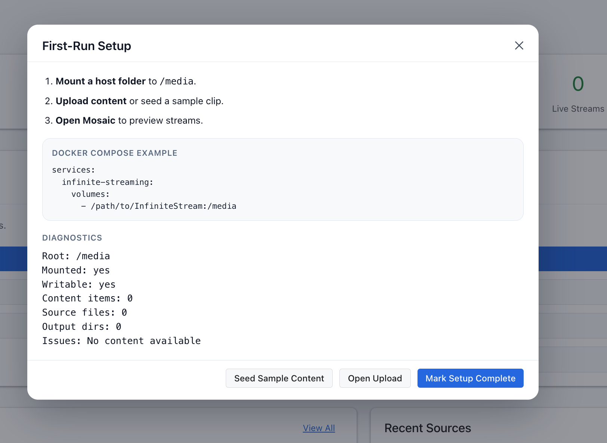

2. **Click Seed Sample Content.** The server synthesises a 120-second 720p test pattern (`testsrc` color bars + numbered frame counter + 1 kHz audio tone) inside the container and saves it as `sample_clip.mp4`. It immediately appears in the **Source Content Library** with its file size, duration, and resolution — confirming the seed step succeeded and the bind-mount is writable.

   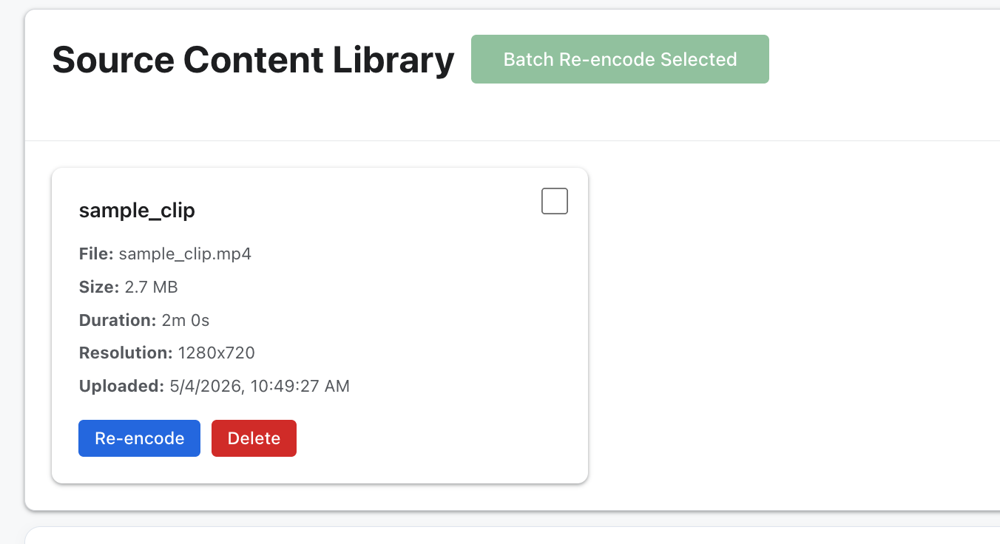

3. **Watch the encode complete.** The same click queues an ABR-ladder encoding job against `sample_clip.mp4`. The **Encoding Jobs** panel auto-refreshes every 2 s; on commodity hardware the seed clip finishes in 60–120 s, producing both H.264 and HEVC ladder variants under `$CONTENT_DIR/dynamic_content/`.

   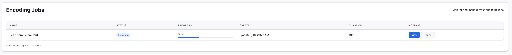

4. **Open Mosaic.** Default filters (`HLS / H264 / 6s`) reduce to a single playing tile of the seeded clip. The numbered frame counter in the test pattern makes it obvious whether segments are arriving in order, looping cleanly, or frozen — you can spot a player or transport problem at a glance, no instrumentation required.

   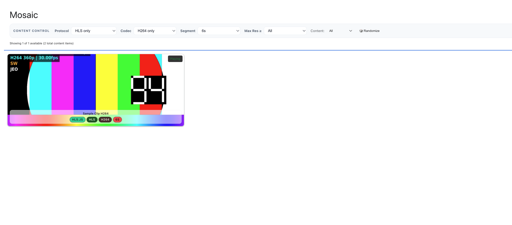

From there, **Playback** plays the same clip standalone, **Testing Session** opens the per-session fault-injection UI, and **Sessions** archives every play. Subsequent dashboard loads skip the modal because `/api/setup/initialize` records a `.infinite-streaming-initialized` marker in `$CONTENT_DIR`. To re-run the OOBE flow on the same volume, delete that marker (or wipe `$CONTENT_DIR` for a true fresh-install reset).

Skipping the seed and uploading your own files via **Open Upload** or by dropping MP4s into `$CONTENT_DIR/originals/` works identically — the seed clip is just a zero-friction "Hello, World" that exercises the full pipeline against content the server generates itself.

Other deployment options (pre-built images, single container, k3s) are in [Advanced deployment](#advanced-deployment) at the bottom.

---

## Your first session (web player walkthrough)

All of the testing features are accessible through the built-in web dashboard. A common first pass:

1. **Load some content.** Open the dashboard → **Upload Content**, pick a video and encoding options, and submit. Or copy a file straight into `$CONTENT_DIR/originals/` and hit refresh on the **Source Library** page.

2. **Watch it play.** Open **Playback**, pick a protocol (HLS / DASH), segment duration (LL / 2s / 6s), codec, and player engine (HLS.js / Shaka / Video.js / Native / Auto). The player starts immediately.

3. **Open a Mosaic comparison.** **Mosaic (Grid)** shows multiple tiles filtered by protocol / codec / segment, all playing the same source, all in sync. Useful for spotting per-player differences at a glance.

4. **Open a Testing Session.** Right-click any tile in Mosaic → **Open in Testing Window**. The testing page binds your browser session to a dedicated proxy port, so failures and shaping you configure here only affect *your* session.

5. **Break things on purpose.** Inside the Testing Session card:
   - **Fault Injection → Segment / Manifest / Master tabs** — inject 404s, timeouts, hangs, corrupted payloads on a repeatable schedule.
   - **Fault Injection → Transport tab** — drop or RST the port via nftables.
   - **Fault Injection → Content tab** — rewrite the HLS master (strip CODECs, hide rungs, overstate bandwidth, change live offset).
   - **Network Shaping** — delay / loss / throughput sliders or scripted patterns (square wave, ramp up/down, pyramid).

6. **Watch the reaction.** The **Bitrate Chart** stacks three time-series charts (bitrate, buffer depth, FPS) on a shared 10-minute timeline. A bandwidth dip, buffer drop, and FPS stutter all line up visually, so root-causing is a matter of eyeballing the three charts together.

7. **Group two sessions for a side-by-side.** Open a second Testing Session for the same source but with a different player engine, live offset, or device — then link the two as a group. From then on, any fault or throughput change applies to **both** simultaneously, while each session keeps its own player config. See [Session grouping](#session-grouping-differential-testing) below for the canonical use cases.

That walkthrough exercises the majority of the system. The sections below describe each part in depth.

---

## Dashboard pages

- **Playback** — single-stream view with protocol, codec, segment, and player selection. Auto-plays on change.
- **Mosaic (Grid)** — multi-tile view with filters (protocol / codec / segment). Right-click a tile to open a Testing Session.
- **Quartet** *(alpha)* — four-panel side-by-side comparison across encodings or players.
- **Live Offset** *(alpha)* — compares live offset, buffer depth, and seekable ranges across variants.
- **Testing Session** — per-session failure injection, traffic shaping, content manipulation, metrics charts. See below.
- **Sessions** — picker over every archived session for the last 30 days. Per-row colored chips flag bad-event types (🚨 911 / ❄️ frozen / ⛔ error / ⏸ segment stall / 🔄 restart) and a red left bar on critical rows make scanning a folder of sessions a glance, not a click-through. Each row has a 📥 button that downloads the session as a portable bundle ZIP.
- **Session Viewer** — replays one archived session through the same charts the live Testing Session page uses (bandwidth, buffer, FPS, player-state vis-timeline, network log). A brush across a session-long rail scrubs to any moment; cross-chart event marker draws a cyan vertical line at the picked event's timestamp on every chart and on the network log.
- **Go-Monitor** — active workers, request counts, last-request time, idle timeout, tick timings.
- **Upload Content** — web upload + encoding job tracking.
- **Source Library** — list of `$CONTENT_DIR/originals/`. Click to kick re-encodes.

Selected content and URL persist across pages in `localStorage` (`ismSelected*`).

---

## Testing session in depth


Open directly if you don't want to come from Mosaic:

```
http://localhost:30000/dashboard/testing-session.html?player_id=<uuid>&url=<encoded-stream-url>
```

The `player_id` is required. go-proxy uses it to allocate a session-specific port (`30181..30881`) so that failure injection and shaping stay scoped to *your* session.

### Controls (top of the card)

- **Retry Fetch** — re-issue the current stream request without resetting the player.
- **Restart Playback** — destroy and rebuild the player, then reload the URL.
- **Reload Page** — full page reload with current query params.
- **Player selector** — HLS.js / Shaka / Video.js / Native / Auto.

### Failure injection (per request kind)

The Fault Injection card has separate tabs for **All**, **Segment**, **Manifest**, **Master**, **Transport**, and **Content**.

- **All** *(default-selected, override)* — one rule applied to every HTTP request kind. Same controls as the Segment tab; when its Failure Type is anything other than `none`, the per-kind tabs disable with an "All override active" banner. Use this when you want a blunt-instrument blast across segments, media manifests, and master at once.
- **Segment / Manifest / Master** — per-kind rules with independent config. Same control shape:
  - **Failure Type** (must be non-`none` to activate).
  - **Units**: Requests / Seconds / Failures-per-Second.
  - **Consecutive**: how wide the fault window is.
  - **Frequency**: spacing between fault windows (full cycle length, not the gap after recovery).
  - **Scope**: which variants the rule applies to (defaults to `All`).

Changes auto-save. The full fault matrix (status codes, socket misbehavior, corruption) is in [`docs/FAULT_INJECTION.md`](docs/FAULT_INJECTION.md).

### Transport faults (per session port)

- **Fault Type**: None / Drop / Reject (via nftables).
- **Units**: Seconds or Packets / Seconds.
- **Consecutive**: duration (seconds mode) or packet threshold (packets mode).
- **Frequency (secs)**: cycle spacing. `0` means one-shot.
- **Counters**: UI shows current/last `Drop pkts` and `Reject pkts`.

Linux-only (macOS Docker Desktop can't do this).

### Network Shaping (per session)

- **Delay / Loss / Throughput** sliders — steady-state shaping (0–250 ms, 0–10%, 0–50 Mbps). Throughput is disabled when a pattern is active.
- **Pattern mode**: `sliders` (static), `square_wave`, `ramp_up`, `ramp_down`, `pyramid`. Non-`sliders` modes drive throughput through a scripted sequence of steps.
- **Step duration**: `6s` / `12s` / `18s` / `24s` — how long each pattern step holds.
- **Margin**: `Exact` / `+10%` / `+25%` / `+50%` — headroom added on top of each ladder bitrate when picking preset rates.
- **Throughput presets** are generated from the current manifest's variants (video + audio, deduped). Effective rate:
  `shaping_mbps = variant_mbps × (1 + margin_pct/100) + overhead_mbps`
  where `overhead_mbps` is computed from the audio playlist bandwidth plus a fixed `0.05 Mbps` playlist allowance. Presets below the lowest video variant (stall-risk threshold) are flagged.

### Content manipulation (HLS master rewriting)

The **Content** tab rewrites the HLS master playlist on the fly — no re-encoding. A fast feedback loop for testing ladder decisions and optional HLS attribute choices.

| Control | Effect | Typical impact |
|---|---|---|
| **Strip CODEC** | Remove `CODECS=` from `EXT-X-STREAM-INF` | Players can't do "chunkless prepare" — longer startup, extra probing fetches |
| **Strip AVERAGE-BANDWIDTH** | Remove `AVERAGE-BANDWIDTH=` | Players that weight average over peak may pick a different initial rung |
| **Overstate Bandwidth** | Inflate `BANDWIDTH` by 10% | Simulates over-conservative encoder declaration; players may sit on lower rungs |
| **Allowed variants** | Allowlist specific rungs — others removed | Sparse / top-heavy / single-rung ladder experiments |
| **Live offset** | `None` / `6s` / `18s` / `24s` hold-back hints | Trade live-edge latency vs rebuffer risk on jitter |

HLS only; DASH is a placeholder. Two-phase: play once to populate the variant list, then replay with the same `player_id`. Full reference in [`docs/FAULT_INJECTION.md`](docs/FAULT_INJECTION.md#manifest-content-manipulation).

### Server Timeouts (transfer active + idle)

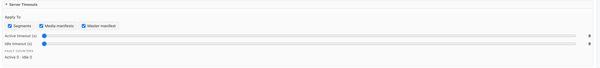

ATS-style transfer timeouts the proxy enforces against the *client* — useful for testing player behavior when the server is slow or stalls mid-body. Two independent values, each gated by a per-kind `Apply To` checkbox:

- **Active timeout (s)** — total wall-clock budget from request received → response complete. Fires whether bytes are flowing or not. Trips pre-headers as **504**, mid-body as a transfer cut.
- **Idle timeout (s)** — gap timer reset on every successful write to the client. Fires when the proxy → player flow goes silent for the configured window — i.e., the player stopped draining bytes.
- **Apply To**: `Segments` / `Media manifests` / `Master manifest`. Off for a kind = no timeout for that kind. Most testing leaves segments-only checked since manifests / master are too small to meaningfully time out.

When a timeout fires the network-log waterfall renders the row with `!⏱` so you can tell it apart from a fault-injection cut (`!✂`) or a player abort (`!↩`).

### Bitrate chart (with buffer depth and FPS)

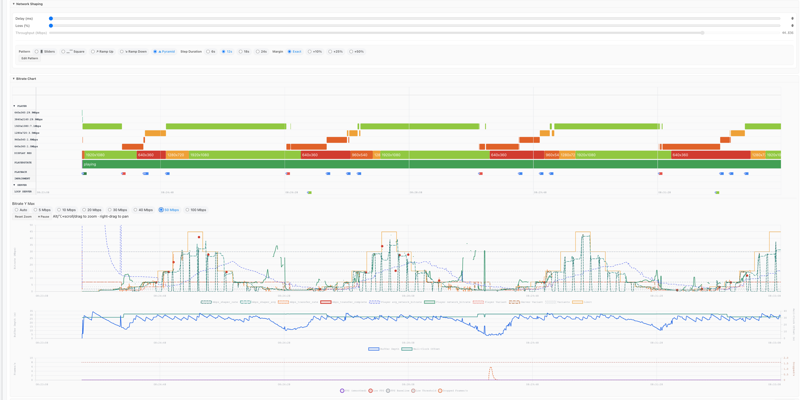

The session card has a collapsible **Bitrate Chart** that stacks an events timeline + up to three time-series charts, all sharing a 10-minute rolling window and unified zoom/pan. Legend entries toggle series, scroll zooms, drag pans, `⏸` pauses live updates. The four panels share an x-axis so a bandwidth dip lines up visually with its buffer / FPS / variant-shift impact.

- **Events timeline** *(top)* — swim-lane visualization of what the player and server are doing right now:
  - **PLAYER variants** — one lane per ladder rung (e.g. `1920×1080:7.1Mbps`, `1280×720:3.5Mbps`). Coloured blocks show which variant the player was on at each moment. The variant shift on a throughput collapse is visible as a downstep across lanes.
  - **DISPLAY RES** — the actual rendered resolution per moment (green = matches the highest available, red = downstepped).
  - **PLAYERSTATE** — `playing` / `paused` / `stalled` lane.
  - **PLAYBACK** + **IMPAIRMENT** — markers for restarts, stalls, error events, fault windows.
  - **SERVER LOOP** — content-loop boundaries from go-live, so wraparound effects line up with player behaviour.
- **Bitrate chart** — up to ten series:
  - **Server metrics**: `mbps_shaper_rate` (100 ms), `mbps_shaper_avg` (6 s rolling), `mbps_transfer_rate` (250 ms, byte-gated), `mbps_transfer_complete` (per segment). See the [Metrics reference](#metrics-reference) below.
  - **Player metrics**: `Player avg_network_bitrate` (averaged ABR bandwidth estimate — iOS `observedBitrate`, Android `DefaultBandwidthMeter`), `Player network_bitrate` (short-window instantaneous throughput — iOS only, from LocalHTTPProxy wire-byte accounting), `Rendition` (bitrate of the current playing variant).
  - **Reference lines**: `Limit` (shaping ceiling, stepped when a pattern is active), `Server Rendition` (what the server believes it delivered), one line per ladder `Variant` (hidden by default).
  - **Events**: `STALL` and `RESTART` markers annotate player stalls and restarts.
  - **Y-axis**: `Auto` or fixed `5 / 10 / 20 / 30 / 40 / 50 / 100` Mbps — pin the scale when comparing two sessions side by side.
- **Buffer depth chart** — player `buffered` TimeRanges (`player_metrics_buffer_depth_s`) on the left axis; **Wall-Clock Offset** (player playhead vs encoder PDT) on the right axis.
- **FPS chart** — rendered and dropped frames/s from `player_metrics_frames_displayed` / `_dropped_frames`, 2 s sliding window, exponential smoothing (α = 0.15). Series: `FPS (smoothed)`, `Low FPS` (red below threshold), `FPS Baseline` (75th percentile), `Low Threshold` (`0.75 × baseline`), `Dropped Frames/s` (right Y-axis).

The four panels' plot areas all align on the same right edge so vertical x-axis ticks line up across every chart and the events timeline above.

### Network log waterfall (HAR view)

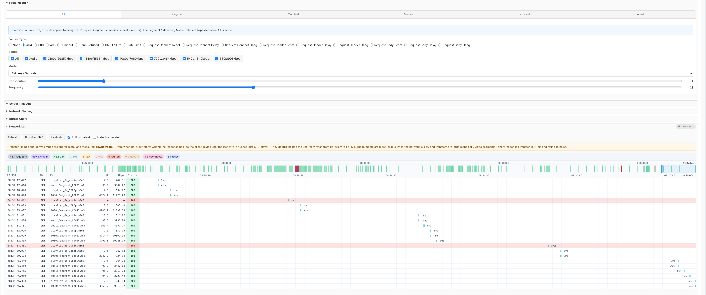

Every request the proxy serves to the player is captured as a HAR-format network log entry. The dashboard renders them in a Chrome DevTools-style waterfall with a brushable overview pane: the brush at the top shows the full session at small scale; drag it to pick a time window, and the bars in the main view position themselves within that window.

Each row is `time | flags | method | path | bytes | Mbps | status | bar`. The **flags** column is the diagnostic disambiguator — when a row's status code can't tell the whole story, the glyph does:

| Glyph | What it means | Status code on the row |
|---|---|---|
| `!` | HTTP fault (404 / 500 / 504 / etc.) — the wire response was the error | matches the fault (`404`, `500`, `504`, `429`, …) |
| `!✂` | Socket fault inject — proxy deliberately tore down the connection (`request_body_*` / `request_first_byte_*` / `request_connect_*`) | `200` (chunked headers went out) or `—` (connect-time abort) |
| `!⏱` | Server transfer timeout — proxy enforced active or idle timeout | upstream's status (typ. `200`) for mid-body, `504` if pre-headers |
| `!↩` | Client gave up — player aborted mid-transfer (broken pipe / `ECONNRESET`) | upstream's status (typ. `200`) |
| `↻` | Quick retry — same URL re-fetched faster than half the segment duration | — |

A row that *looks* like a successful 200 download but has `!↩` or `!⏱` next to its method tells you the player abandoned it or the proxy gave up — exactly the signal you'd otherwise miss.

---

## Session grouping (differential testing)

Link two or more independent Testing Sessions into a **group**. Faults and network shaping applied to any group member are applied to **all** members simultaneously — while everything else stays independent per session. This is the single highest-leverage feature for *differential* testing: change exactly one variable and watch several targets react to an identical stimulus.

### What propagates vs what stays independent

| Propagates to all group members | Stays per-session |
|---|---|
| HTTP fault configuration (segment / manifest / master — type, mode, consecutive, frequency, URL allowlist) | Player engine (HLS.js / Shaka / Video.js / Native) |
| Transport faults (DROP / REJECT, timing) | Stream URL (protocol / codec / segment duration) |
| Network shaping — delay, loss, throughput, pattern mode, step duration, margin | Content-tab manipulations (strip CODEC, allowed variants, live offset, etc.) |
| Shaping patterns (square wave, ramps, pyramid) and their step schedules | Player selector and URL parameters |

Max 10 sessions per group. Endpoints: `POST /api/session-group/link`, `POST /api/session-group/unlink`, `GET /api/session-group/{groupId}` — see [`docs/FAULT_INJECTION.md`](docs/FAULT_INJECTION.md#session-grouping).

### Canonical use cases

- **Same stream, two live offsets.** Session A at `live_offset=6s`, session B at `live_offset=24s`. Apply a 3-second throughput collapse to the group. A rebuffers, B absorbs it — now you know exactly how much headroom the larger offset is buying you.
- **iOS vs Android under identical conditions.** Open one testing window driving an iOS simulator, another driving the Android player, group them, and drive a `ramp_down` pattern. The Bitrate / Buffer / FPS charts side by side show how each platform's ABR algorithm responds to the same wire-rate curve, with zero variance from network timing.
- **HLS.js vs Shaka on the same packet-loss schedule.** One click, two engines, identical 2% loss + 80 ms delay — does one rebuffer and the other ride it out?
- **H.264 vs HEVC under identical throttle.** Same variants on the ladder, different codec, grouped session — how does each codec's bitrate-for-quality affect rebuffer frequency when throughput drops below the 720p rung?
- **Sparse ladder vs full ladder.** Drop rungs with the Content tab's `Allowed variants` allowlist and compare. This matters most when the gaps are in the **low or middle** of the ladder — a player with only 360p and 4K and no steps in between has nowhere to land when throughput drops through that gap. On a choppy network the ABR logic will overshoot or undershoot, and the player can stall or thrash between the two available rungs instead of glide-downshifting. Group a full-ladder session against a gap-ladder session, drive `ramp_down` with oscillation, and watch the gap-ladder session rebuffer while the full-ladder one rides it out. Critical for validating that your production ladder actually survives poorly-behaving networks, not just smooth downshifts.
- **Same player, different Content-tab settings.** Identical engine, identical stream, grouped — but A has `Strip CODEC` on and B doesn't. Watch startup time diverge under the same network conditions.

The pattern is always: **change one variable per session, apply the same fault or shaping change to all of them, compare charts side by side.** The Bitrate / Buffer / FPS charts share a timeline across sessions, so you see effect alignment by eye.

---

## Analytics tier

**Set it and forget it.** With the analytics backend and the Sessions screens in place, the dashboard stops being a foreground-required watching tool and becomes a record-and-triage one. Leave a single Testing Session — or a stack of grouped sessions running a differential test — going for hours, overnight, across a weekend. The forwarder archives every snapshot and every HAR entry as they happen; the auto-classifier flags sessions that hit "really bad things" (errors, frozen, segment stalls, restarts, 911 marks) as `interesting`, the picker red-bars those rows, and 🚨 / ❄️ / ⛔ chips count the specific failures per session. When you come back, you don't replay every play that ran — you scan the picker for red bars and chip clusters, click into the handful that actually went sideways, and ignore the dozens that ran clean. A multi-day soak that would otherwise need a human watching turns into a five-minute morning triage.

A sidecar stack (ClickHouse + Grafana + a small Go forwarder) auto-archives session metrics and per-request HAR for 30 days. Lives entirely under [`analytics/`](analytics/) — operationally independent of the live streaming path: if the forwarder dies, the live UI keeps working, archival just pauses until it restarts.

| Component | Role |
|---|---|
| `clickhouse` | Two wide tables (`session_snapshots`, `network_requests`) with 30-day TTL. Hot fields are typed columns; everything else lands in a `session_json` blob. |
| `go-forwarder` | Subscribes to go-proxy's `/api/sessions/stream` SSE, dedupes by snapshot fingerprint, batches inserts into ClickHouse. Also serves `/api/sessions`, `/api/snapshots`, `/api/session_events`, `/api/network_requests`, `/api/session_heatmap`, `/api/session_bundle` — read-only, parameterized SQL, behind `nginx /analytics/api/`. |
| `grafana` | Provisioned-as-code dashboards under [`analytics/grafana/provisioning/`](analytics/grafana/provisioning/). Reachable via `nginx /grafana/`. |

**Operating it**: `make analytics-rebuild-forwarder` recreates the forwarder container in-place (live UI untouched); `make analytics-update` reloads Grafana provisioning; `make analytics-migrate SQL='ALTER TABLE …'` runs a schema change. The data is exposed read-only to the dashboard via parameterized ClickHouse queries — no string interpolation, no auth-token leakage.

**Securing for WAN deployment**: opt-in HTTP Basic auth via `INFINITE_STREAM_AUTH_HTPASSWD` gates the dashboard, `/analytics/api/`, and `/grafana/`; player-app endpoints stay public so unattended Apple/Roku/AndroidTV clients keep working. ClickHouse binds to `127.0.0.1` only by default. See [`analytics/README.md`](analytics/README.md) for the docker-compose and k3s runbooks.

The two pages downstream of this stack — **Sessions view** (the picker) and **Session Viewer** (replay one) — are described in their own sections below.

---

## Sessions view (the picker)

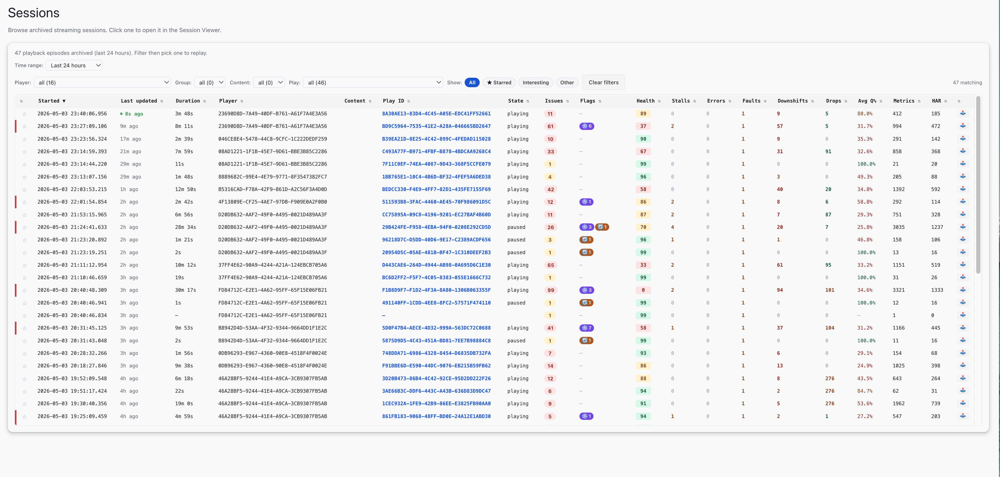

The Sessions page (`dashboard/sessions.html`) is the **triage entry point** for archived plays. One row per `(session_id, play_id)` over the last 30 days, sorted newest first. Designed so an operator can scan a long list and spot the bad ones without opening each.

**Capture & triage hooks** — two cross-platform mechanisms drop "look-at-me" markers on the picker:

- **911 button** — every player (iOS / iPadOS / tvOS / Android TV) has a "911" button right of Reload. One tap fires a `user_marked` event that lands as a row in `session_snapshots.last_event` and as a 🚨 chip on the picker row. Cross-layer "911" log lines on Apple device console, `adb logcat`, and docker logs make it grep-friendly across all three layers.
- **📥 bundle download** — each picker row and the Session Viewer banner both have a download button that streams the session as a portable `.zip` (`snapshots.ndjson` + `network.har` + `session.json` + `README.md`). Sensitive headers and credential-shaped query params are redacted server-side. See [`analytics/README.md`](analytics/README.md) for the bundle format.

**Picker UI**:

- **Per-row event chips.** Each row carries colored chips for every "really bad thing" the auto-classifier flagged — 🚨 user-marked (the 911 button), ❄️ frozen, ⛔ error, ⏸ segment stall, 🔄 restart. Counts on each chip make a long stall-recovery sequence visually distinct from a single hiccup.
- **Critical-row red bar.** Sessions classified as `interesting` by the auto-classifier (or pinned by an operator) get a red left edge so a folder of fifty sessions scans like a status board, not a list.
- **Filters across the top.** Time range, classification (interesting / starred / other), platform (iOS / Android / web), content. Filters apply to the same query that drives the list and the per-tier counts in the header.
- **⭐ star.** Pin a session for permanent retention beyond the 30-day TTL, regardless of whether the auto-classifier flagged it.
- **Right-click → Open in new tab.** Useful when comparing two sessions side-by-side.

When something stands out — a row with a 🚨 chip, a stack of ⛔ errors, a stall-and-recover sequence — click the row to drop into the Session Viewer for that play.

---

## Session Viewer (replay one play)

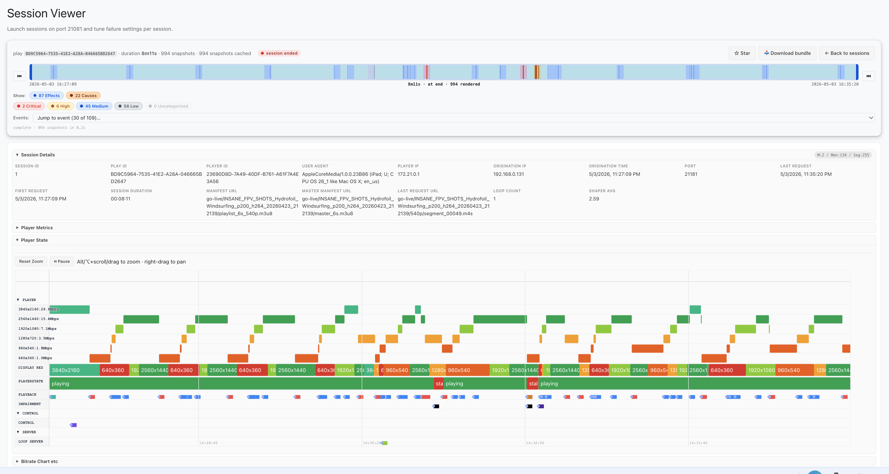

The Session Viewer (`dashboard/session-viewer.html?session=<sid>&play_id=<pid>`) replays one archived play through the same chart stack the live Testing Session page uses. Same widgets, frozen data, with two viewer-only additions across the top.

### Scrub bar (top)

A session-long rail across the page header shows the entire play's wall-clock span. A movable brush selects the visible window for every chart on the page. Drag the brush to scrub forward / backward; resize its edges to widen or narrow the inspected window.

- **Tick markers** on the rail mark significant events (errors, frozen, segment stall, restarts, user-marked) at their exact session-relative position. Eye-glance overview of where the trouble was, without expanding any chart.
- **Brush window propagates everywhere.** The bandwidth chart, buffer-depth chart, FPS chart, the player-state vis-timeline above them, *and* the network-log waterfall fold all retarget to the brushed range as you drag. One control, all charts.
- **Cross-chart event marker.** Click any event row in the events-timeline dropdown and a vertical cyan line drops onto every chart at that event's exact timestamp — and an entry highlights in the network log waterfall. Pin moments cross-chart without comparing timestamps in your head.

### Event filters (top toolbar)

Right of the scrub bar is a row of priority chips and an events dropdown.

- **P1 / P2 / P3 / P4 priority chips.** Every event type has a triage priority (set by the forwarder at classification time). The chips toggle whole groups on/off — P1+P2+P3 visible by default, P4 (informational) hidden. Persisted in `localStorage` so a power user's "I only care about stalls and errors" preference sticks across sessions.
- **Per-event-type filter (right-click on a priority chip).** Fine-grained override of the priority-level toggle. Use it when you want everything-but-buffering, or only-stalls-and-errors.
- **Events dropdown.** A scrollable list of every event in the play, grouped by priority then by type. Click any row to drop the cross-chart event marker on that moment.

### Same charts as live Testing Session

Below the brush + filters: bandwidth chart (with buffer depth and FPS overlays), buffer-depth chart, FPS chart, player-state vis-timeline (variant lanes, display-resolution lane, player-state lane, control lane, server lane), and the network-log waterfall fold. All chart events plot at the player-recorded `player_metrics_event_time` rather than browser-receive time, so cross-chart alignment holds even when the SSE pipeline jitters relative to the device clock.

- **⭐ star and 📥 bundle download** in the banner — same controls as the picker row, applied to the play in view.
- **🚨 last-event marker** if the play included a `user_marked` event — vertical line on every chart at the exact moment of the 911 press.

---

## Third-party players

The Testing Session flow isn't limited to the built-in browser players. Any HTTP client — a native iOS/tvOS/Android app, a Roku channel, a set-top-box player, a CI harness — can be the video engine inside a session, get the same faults and shaping applied to it, and optionally stream metrics back into the dashboard's charts.

### The easy way: grab a session URL from Mosaic

Inside the dashboard, right-click any tile in **Mosaic (Grid)** → **Open in Testing Window**. That builds the session URL:

```
http://<host>:30000/dashboard/testing-session.html?url=<stream-url>&player_id=<uuid>&nav=1
```

For 3rd-party integrations you want the `player_id` and `url` values — those are the only two pieces of state a session needs. Paste the stream URL into your player and use the `player_id` on everything described below.

### Programmatic integration pattern

A native app integrates in four steps, all plain HTTP:

1. **List content.** `GET /api/content` returns the encoded library — content names, protocol flags (`has_hls` / `has_dash`), codec metadata. Stream URLs are **not** embedded in the response; you build them from the content name.

2. **Generate a `player_id`.** Any stable string unique to your session — a UUID, `"roku_<timestamp>"`, `"android-rig-03"`. Reuse the same id across the session's lifetime.

3. **Build the stream URL and play it.** Append `?player_id=<id>` to the manifest path:

   ```
   http://<host>:30081/go-live/<content>/master.m3u8?player_id=<id>       # HLS LL
   http://<host>:30081/go-live/<content>/master_2s.m3u8?player_id=<id>    # HLS 2s
   http://<host>:30081/go-live/<content>/master_6s.m3u8?player_id=<id>    # HLS 6s
   http://<host>:30081/go-live/<content>/manifest.mpd?player_id=<id>      # LL-DASH
   ```

   The proxy allocates a dedicated session port on first request and responds with `302` to the allocated port (e.g. `30081` → `30281`). **Follow the redirect** — all subsequent segment and playlist requests must stay on that port so faults and shaping apply. Every HLS.js/Shaka/AVPlayer/ExoPlayer/Roku player handles 302 redirects natively; this is zero work for the client.

4. **Optional: subscribe to session updates.** Open a Server-Sent Events stream at `GET /api/sessions/stream` to receive live updates when the dashboard operator changes faults, shaping, or group membership affecting your session. The iOS app uses this to mirror the operator's actions into its own testing UI.

That's it. The app is now a first-class Testing Session — any operator who opens the dashboard sees the session appear in the session list and can inject faults / shape bandwidth / group it alongside other sessions.

### Reporting metrics back (optional but recommended)

To make your 3rd-party player show up on the **Bitrate / Buffer / FPS charts** alongside the built-in web players, `POST /api/session/{player_id}/metrics` periodically with a `set` payload:

```json
{
  "set": {
    "player_metrics_video_bitrate_mbps": 4.2,
    "player_metrics_avg_network_bitrate_mbps": 5.1,
    "player_metrics_network_bitrate_mbps": 4.9,
    "player_metrics_buffer_depth_s": 18.4,
    "player_metrics_frames_displayed": 12345,
    "player_metrics_dropped_frames": 7,
    "player_metrics_last_event": "playing",
    "player_metrics_loop_count_player": 2,
    "player_metrics_profile_shift_count": 4
  }
}
```

Post cadence: 1–2 Hz is fine. The endpoint doesn't bump the session's control revision (it's observational data), so you won't fight with the operator's configuration changes. Report what your platform can measure — any subset is fine.

The full field catalogue and payload reference is in [`docs/API.md`](docs/API.md#go-proxy-sessions--faults).

### What the bundled clients do

The iOS, tvOS, Android, and Roku apps in this repo are reference implementations of the pattern above:

| App | Content list | URL build | Session redirect | SSE | Metrics |
|---|:---:|:---:|:---:|:---:|:---:|
| [`apple/InfiniteStreamPlayer/`](apple/InfiniteStreamPlayer/) — iOS + tvOS | yes (`/api/content`) | `?player_id=UUID` | auto-follow | yes | yes |
| [`android/InfiniteStreamPlayer/`](android/InfiniteStreamPlayer/) | yes (`/api/content`) | `?player_id=UUID` | auto-follow (ExoPlayer) | — | — |
| [`roku/InfiniteStreamPlayer/`](roku/InfiniteStreamPlayer/) | yes (`/api/content`) | `?player_id=roku_<ts>` | auto-follow | — | — |

They're all intended as very simple video consumption devices, each with slightly different ABR characteristics and error-recovery implementations. The web players (HLS.js / Shaka / Video.js) are the simplest to use and very handy to confirm everything is wired up — but they're also the least reliable for stress testing. See [Project scope and roadmap](#project-scope-and-roadmap) for which paths get the most testing time.

Point at any of them as a starting template for a new platform.

---

## How it works

### Services (all run inside one Docker container)

| Service | Port | Role |
|---|---|---|
| `go-live` | 8010 | LL-HLS + LL-DASH generator (2s / 6s / LL segment variants) |
| `go-upload` | 8003 | Upload API, encoding job orchestration, content discovery |
| `go-proxy` | 30081 (+ per-session ports) | Failure injection, traffic shaping, SSE session stream |
| `nginx` | 30000 | Routing, static dashboard |
| `memcached` | 11211 | Session state (internal) |

### Live stream generation

- **On-demand**: the first request for a piece of content starts a per-content worker.
- **Single worker, shared clock**: each worker generates all HLS + DASH manifests (LL + 2s + 6s) in sync.
- **Low-latency**: LL-HLS and LL-DASH update on partial boundaries (default 200 ms).
- **Segment variants**: 2s and 6s update on their segment boundaries only.
- **Sliding window**: fixed (e.g. 36 s) that moves forward and wraps on loop boundaries.
- **Auto shutdown**: workers stop after an idle timeout when no requests are active.

### Host filesystem & content

Host-mounted volume at `/media` inside the container:

- `/media/originals/` — source files (MP4, MOV, etc.)
- `/media/dynamic_content/{content}/` — encoded outputs
- `/media/certs/` — TLS certs (auto-generated if missing)

Three ways to add content:

- **Upload via the dashboard.** Open **Upload Content**, pick a file and encoding options. The server writes the source to `/media/originals/` and the encoded ladder to `/media/dynamic_content/`.
- **Drop a source file in and encode from the UI.** Copy into `$CONTENT_DIR/originals/`, refresh **Source Library**, and trigger an encode from the UI.
- **Drop pre-encoded ladders in directly.** If you've already run the pipeline offline (locally or on a build machine), copy the whole `{content}/` directory into `$CONTENT_DIR/dynamic_content/`. It appears in the dashboard immediately — no import step.

To encode outside the dashboard (offline, in CI, or on a build box):

- Run the pipeline locally with [`generate_abr/create_abr_ladder.sh`](generate_abr/README.md). See [`generate_abr/QUICKSTART.md`](generate_abr/QUICKSTART.md) for common invocations and [`generate_abr/HARDWARE_ENCODING_QUICKREF.md`](generate_abr/HARDWARE_ENCODING_QUICKREF.md) for hardware-accelerated encodes.
- Offload to AWS EC2 spot instances via [`docs/CLOUD_ENCODING.md`](docs/CLOUD_ENCODING.md) — the cloud runner produces the same `{content}_h264/` and `{content}_hevc/` directory layout, so the output drops straight into `/media/dynamic_content/`.

### Primary endpoints

**HLS:**
- `http://localhost:30000/go-live/{content}/master.m3u8` (LL)
- `http://localhost:30000/go-live/{content}/master_2s.m3u8`
- `http://localhost:30000/go-live/{content}/master_6s.m3u8`

**DASH:**
- `http://localhost:30000/go-live/{content}/manifest.mpd` (LL)
- `http://localhost:30000/go-live/{content}/manifest_2s.mpd`
- `http://localhost:30000/go-live/{content}/manifest_6s.mpd`

Full API (`/api/content`, `/api/jobs`, `/api/sessions/*`, `/api/nftables/*`, etc.) is in [`docs/API.md`](docs/API.md).

---

## Metrics reference

### Throughput metrics

| Metric | Update cadence | What it measures |
|---|---|---|
| `mbps_shaper_rate` | 100 ms | Instantaneous shaped rate during active queue drain (1 s contiguous backlog-active run) |
| `mbps_shaper_avg` | 100 ms | Rolling 6 s average of `mbps_shaper_rate` values |
| `mbps_transfer_rate` | 250 ms | Byte-change-gated rate during segment transfer, aligned to HTB burst edges. Reports at drain/refill boundaries |
| `mbps_transfer_complete` | per segment | Total bytes / total time for one completed segment transfer (backlog drained to 0) |

### Metric semantics

- **Limit value** (`nftables` shaping rate): configured ceiling for the session port; a control target, not a measured throughput.
- **Shaper metrics** (`mbps_shaper_rate`, `mbps_shaper_avg`): from TC class byte counters on the 100 ms updatePort loop. Only active when TC shaping is configured (backlog > 0). `shaper_rate` goes to 0 on drain; `shaper_avg` smooths across segments.
- **Transfer metrics** (`mbps_transfer_rate`, `mbps_transfer_complete`): from the 10 ms awaitSocketDrain goroutine. `transfer_rate` aligns to actual TC burst edges (250 ms min gap). `transfer_complete` is the ground-truth per-segment rate.
- **Player averaged bandwidth** (`player_metrics_avg_network_bitrate_mbps`): player-side averaged ABR estimate; slow-moving, model-based; intended for ladder analysis, initial variant pick, and comparison against shaper average. Populated by iOS (AVPlayer `observedBitrate`), Android (`DefaultBandwidthMeter.bitrateEstimate`), and browser players (HLS.js / Shaka / native) — i.e., the one signal every player can provide.
- **Player instantaneous bandwidth** (`player_metrics_network_bitrate_mbps`): short-window near-instantaneous wire throughput; reacts quickly to sudden rate drops. Requires per-request wire visibility, so currently iOS-only (via LocalHTTPProxy); null on clients without that plumbing.
- **Wall-clock offset** (`player_metrics_true_offset_s`): how far behind live the player is, computed *server-side* and *independent of the client's clock*. Players post `player_metrics_playhead_wallclock_ms` (the encoder's PDT at the playhead); the server timestamps the receive moment with its own clock and reports the difference: `true_offset_s = (server_received_at_ms − playhead_wallclock_ms) / 1000`. Survives clock skew on the client device, drift between phone NTP and laptop NTP, and any offset the player engine applies. Surfaced as a session-item field, on the buffer-depth chart's right Y-axis, and as the basis for cross-client comparison on the Live Offset page.

Under steady conditions: `shaper_rate` and `transfer_rate` track near the configured limit; `transfer_complete` is the most trustworthy single number. The player averaged bandwidth broadly tracks wire metrics but is smoother; the instantaneous version catches rate drops fastest.

Implementation details (netlink counters, caching, scope of overhead inclusion) are in [`docs/ARCHITECTURE.md`](docs/ARCHITECTURE.md#wire-metric-implementation).

---

## Encoding pipeline

Driven by `generate_abr/create_abr_ladder.sh` (ffmpeg + Shaka Packager v3.4.2, bundled in the container).

Defaults: segment duration **6 s**, partial duration **200 ms**, GOP duration **1 s**.

**Audio**: source audio is normalized to **AAC** during transcode (`always-AAC`). Source tracks in non-AAC codecs are re-encoded so every variant on the ladder has a uniform audio layer, eliminating an entire class of "this segment plays on iOS but not Android" debugging.

**Synthetic source content**: `make test-pattern` generates a 4K test pattern clip you can use as a controlled source — no copyrighted material, deterministic visuals, useful when testing ABR / ladder behaviour without confounding "is this just because of the content?" questions.

See [`generate_abr/README.md`](generate_abr/README.md) for the pipeline, [`generate_abr/QUICKSTART.md`](generate_abr/QUICKSTART.md) for common commands, and [`docs/CLOUD_ENCODING.md`](docs/CLOUD_ENCODING.md) for offloading encodes to AWS EC2 spot instances.

---

## Known limitations

Common LL-HLS/LL-DASH features that are **not fully implemented**:

- Blocking playlist reload (`_HLS_msn`, `_HLS_part`) and skip logic (`_HLS_skip`)
- `#EXT-X-RENDITION-REPORT` and `#EXT-X-PRELOAD-HINT`
- Chunked CMAF transfer for LL-DASH partials

Full list in [`PRD.md`](PRD.md).

---

## Project scope and roadmap

This is a hobbyist QA tool, built and primarily run on an M5 MacBook. The web UI isn't perf-tuned, and the server isn't built for production scale — it's tuned for a handful of test sessions running locally, where the goal is *deterministic, reproducible* behaviour over throughput. The "When not to use it" call-outs near the top of this README list the limits that implies.

### Platform priorities

Where the time goes, in order:

- **LL-HLS / fmp4 on Apple (iOS / iPadOS / tvOS)** — primary tested path. New content-generation behaviour gets validated here first.
- **Android TV / Google TV** — second-tier. The reference app works, but the surface area exercised against it is narrower (no SSE, no metrics reporting yet).
- **LL-DASH** — functional but exercised less than HLS. Some dashboard features (Content-tab manifest rewriting) are HLS-only.

### Roadmap

The project is built in stages, each one depending on the previous:

1. **Repeatable playback, independent of external factors.** *Done.* Looping VOD-as-live with a shared clock across LL / 2s / 6s variants — the same run produces the same timing.
2. **Repeatable failures and controls.** *Done.* Fault injection, traffic shaping, content manipulation — all per-session, all scriptable through the REST API.
3. **Persistent session storage for offline viewing and analysis.** *In progress.* The [analytics sidecar](analytics/README.md) (`feat/336-analytics-sidecar`) subscribes to the proxy's SSE session stream, writes snapshots into ClickHouse, exposes them to Grafana, and powers `testing.html?replay=1&session=<id>` replay mode.
4. **Scripted characterization and cross-thing comparison.** *Future.* Use the controls from stage 2 and the recorded sessions from stage 3 to systematically compare ABR behaviour across players, codecs, ladders, platforms, and network conditions — turning side-by-side eyeballing into reproducible benchmarks.

No dates, no commitments — this is a side project.

---

## Client apps

Native client apps for device testing:

- **iOS / iPadOS / tvOS** — SwiftUI app in [`apple/InfiniteStreamPlayer/`](apple/InfiniteStreamPlayer/)
- **Android TV / Google TV** — Jetpack Compose app in [`android/InfiniteStreamPlayer/`](android/InfiniteStreamPlayer/README.md)
- **Roku** — BrightScript channel in [`roku/InfiniteStreamPlayer/README.md`](roku/InfiniteStreamPlayer/README.md)

The Apple and Android TV apps share a cinematic dark UI built around a "Now Playing" hero + LIVE preview tiles, a slide-from-right Settings drawer, and a developer-mode HUD overlay during playback. Roku is intentionally minimal (basic playback channel).

### First launch — Choose a server

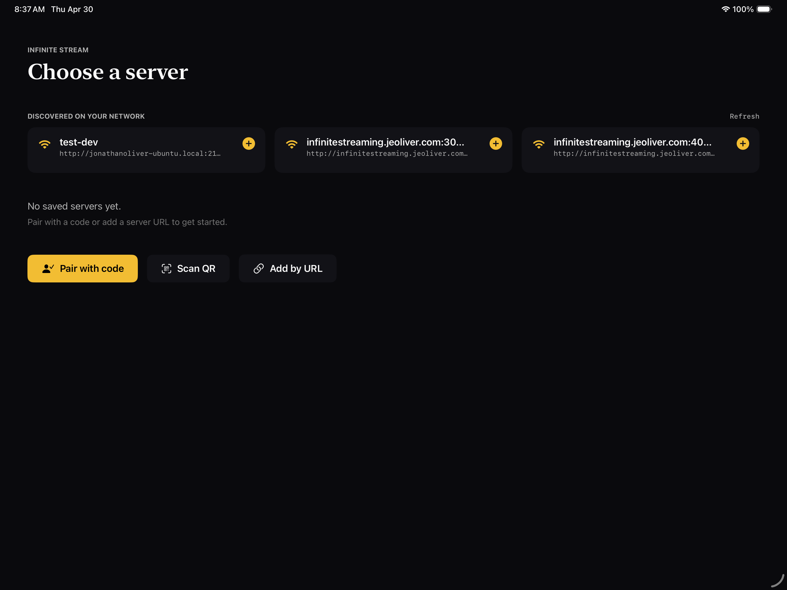

On first launch the app routes to the Server Picker. It auto-lists servers it discovers on the network (rendezvous heartbeat), and offers **Pair with code** (cross-network) / **Scan QR** (same-LAN) / **Add by URL** (manual) as fallbacks. Once a server is saved, subsequent launches go straight to Home.

### Home — NOW PLAYING + LIVE tiles

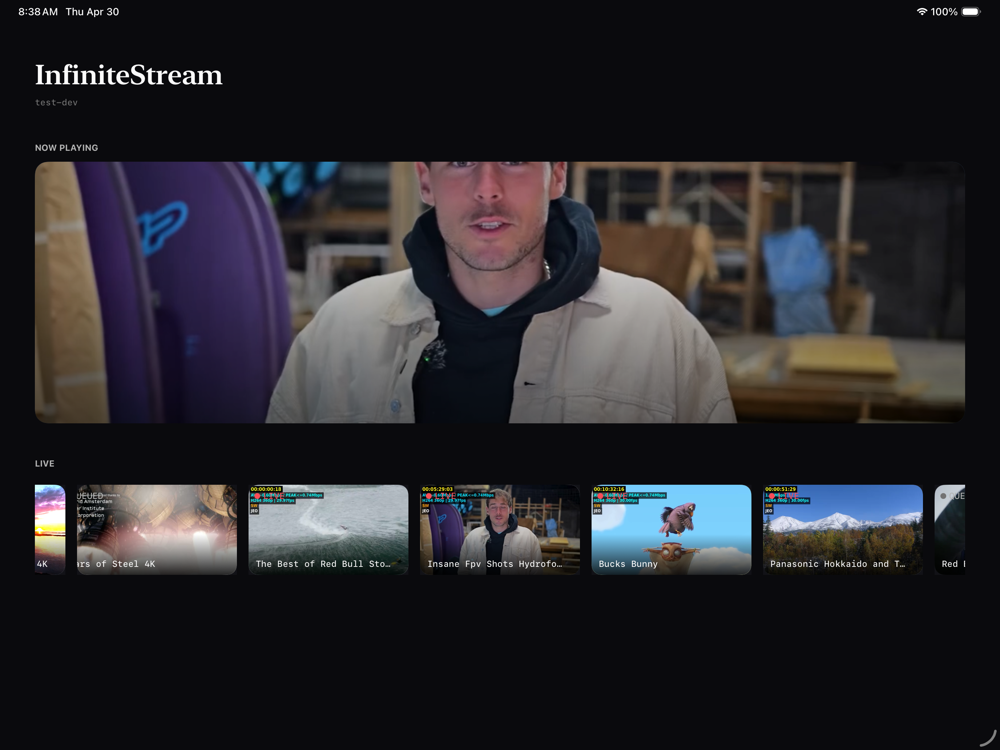

Hero "NOW PLAYING" tile carries the most recently played stream; the **LIVE** row below shows live preview thumbnails for every other available stream. On capable hardware the tiles run real LL-HLS previews (capped per the device's decode budget), so you see actual frames not stale stills. Tapping a tile pushes it into the hero / starts playback.

### Playback — developer-mode HUD

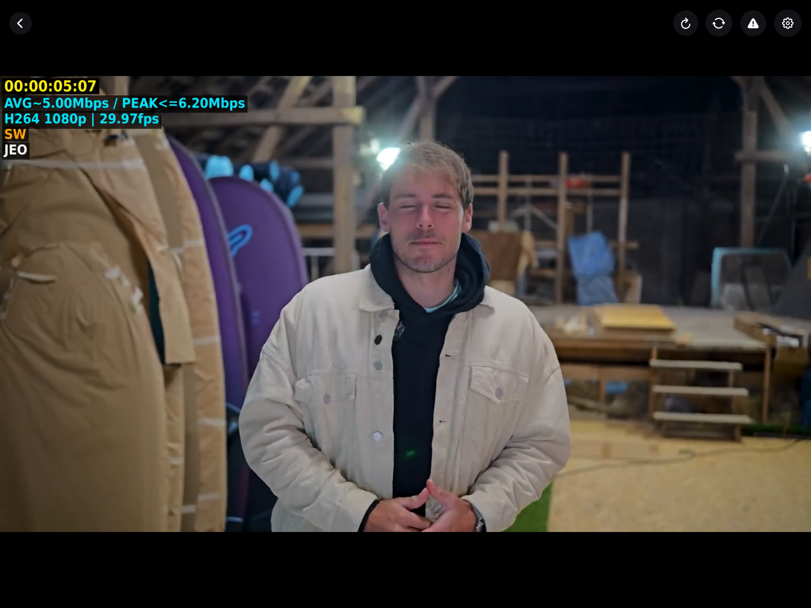

Toggle **Developer mode** in Settings → Advanced to overlay a live HUD on the player. Reads the same metrics the dashboard's Bitrate Chart shows — wall-clock timestamp, AVG / PEAK Mbps observed, current codec / resolution / framerate, and which bandwidth meter the player is reporting from (`SW` = software / OS-reported, `JEO` = JS engine override). Useful when the dashboard isn't open and you just want to see what the player thinks at 10 feet from the screen.

### Settings drawer

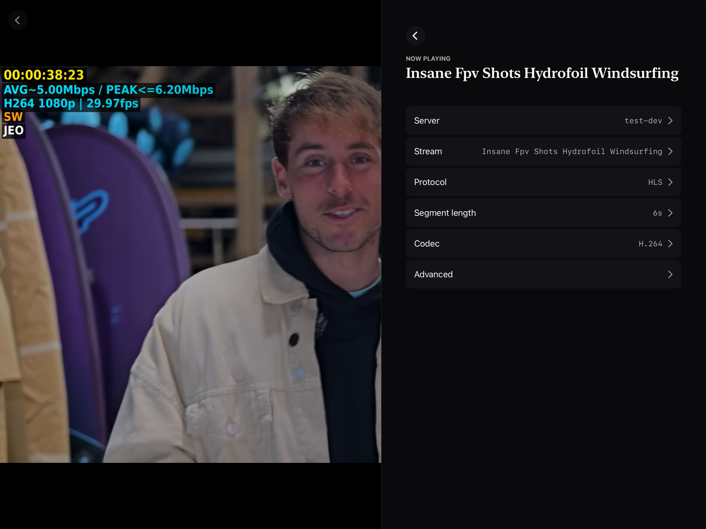

Slide-from-right drawer lists Server / Stream / Protocol / Segment length / Codec / Advanced. The first row jumps to the Server Picker; the rest are pickers that push in over the main list. Same pattern on iPad and Apple TV (D-pad on tvOS, touch on iPad).

### Settings → Advanced + Reset All Settings

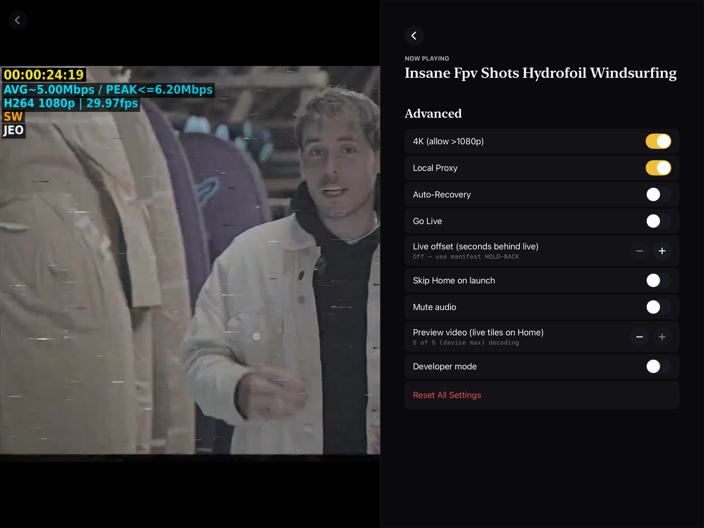

Advanced exposes the per-session toggles that affect playback behaviour: **4K** (allow renditions above 1080p), **Local Proxy** (route through go-proxy for wire-byte metrics), **Auto-Recovery** (retry on player error), **Go Live** (snap to live edge), **Live offset** (seconds behind live), **Skip Home on launch** (auto-resume), **Mute audio**, **Preview video** (live tile decode budget), **Developer mode** (the HUD above).

The destructive **Reset All Settings** at the bottom wipes every persisted preference (server list, Advanced flags, playback history) and routes back to the Server Picker — equivalent to a fresh install but without losing the app itself. Available on iOS, iPadOS, tvOS, and Android TV.

---

## Server discovery

The native client apps need a way to find your server URL on first launch — they can't ship a hardcoded address. There are four ways to add a server, each suited to a different network situation:

| Method | When to use | What it needs |
|---|---|---|
| **Same-WAN auto-discovery** | Phone/TV on the same Wi-Fi as the server | Server announces to the rendezvous; client lists it |
| **QR scan** (iOS only) | Same-LAN, you have a phone with a camera | Open Server Info on the dashboard, scan the QR |
| **Pair with code** | Cellular, VPN, hotel Wi-Fi — TV on a *different* network than the dashboard | Dashboard publishes its URL keyed by a 6-character code shown on the TV |
| **Manual entry** | Always works as a fallback | Type host:port |

### How auto-discovery works

A small Cloudflare Worker (`cloudflare/pair-rendezvous/`) acts as a public rendezvous point. Every server with `INFINITE_STREAM_ANNOUNCE_URL` set heartbeats `{server_id, url, label}` to the Worker on boot, again every 12 hours, and on demand when the dashboard's Server Info modal is opened.

Each announce is keyed by the server's public IP (hashed for privacy). When a client app opens its "+ Add server" / "Pair…" screen, it asks the Worker which servers are visible from *its* public IP. Cloudflare's edge sees both sides' IPs and only returns servers that match — so the list is implicitly scoped to "servers on the same WAN as you".

> **Why not Bonjour/mDNS?** The obvious LAN-discovery answer is mDNS (`_infinitestream._tcp`), and we tried it. It doesn't work when the server runs inside a Docker container: Docker's default bridge network filters multicast, so the advertisement never reaches the host's network. Even host-network mode is fragile across Linux/macOS/Windows. Cloudflare's same-public-IP check gives us the same "show me servers on my network" answer without depending on multicast working through the container.

### How code-based pairing works

Camera-less TVs (Apple TV, Android TV) can't scan a QR. Instead the TV shows a 6-character code; the user types it into the **Pair with code** widget on the dashboard, which publishes the dashboard's URL keyed by that code. The TV is polling the rendezvous for that code and picks up the URL within a couple of seconds. Cross-network pairing only works if the dashboard URL is reachable from the TV (the Server Info modal warns you when the URL looks LAN-only).

### External services

- **Cloudflare Workers + KV** for the rendezvous. Fits comfortably in the free plan: each server costs ~2 KV writes/day at the default cadence (1,000 writes/day total budget, account-wide). The default Worker is at `https://pair-infinitestream.jeoliver.com` — to self-host, follow [`cloudflare/pair-rendezvous/README.md`](cloudflare/pair-rendezvous/README.md) and override `INFINITE_STREAM_RENDEZVOUS_URL` (server) plus `InfiniteStreamRendezvousURL` (UserDefaults / SharedPreferences on the clients).

> **Forking?** That default URL is the upstream maintainer's personal Worker. Please deploy your own Worker and change the `defaultURL` constant in `apple/.../RendezvousService.swift` and `android/.../RendezvousService.java` (plus the `routes` block in `wrangler.toml`) before shipping builds — otherwise your users hammer someone else's free-tier KV budget.

That's it — no third-party services beyond a Cloudflare account.

### Server-side env

| Var | Purpose |
|---|---|
| `INFINITE_STREAM_RENDEZVOUS_URL` | Rendezvous Worker base URL. Required to enable any pairing. |
| `INFINITE_STREAM_ANNOUNCE_URL` | URL that clients should use to reach this server (e.g. `http://lenovo.local:30000`). When set, this server appears in same-WAN auto-discovery. |
| `INFINITE_STREAM_ANNOUNCE_LABEL` | Optional friendly label. Defaults to `host:port` from the announce URL. |
| `INFINITE_STREAM_SERVER_ID` | Optional explicit announce ID (4–64 chars `[A-Za-z0-9_-]`). Defaults to a stable random ID persisted at `<data_dir>/server_id`. Set this when multiple deployments share the same data directory (e.g. dev + release pods on the same k3s node), otherwise their announces overwrite each other on the rendezvous. |

### HTTP, HTTPS, and iOS App Transport Security

The server defaults to plain HTTP on its dashboard / API / playback ports. That's fine for **LAN use** and **HTTPS-fronted public deployments**, but **plain HTTP to a public hostname** trips the platform-specific cleartext-traffic rules baked into modern OSes:

| Client | Cleartext to LAN (`localhost`, `*.local`, RFC1918) | Cleartext to public hostname |
|---|---|---|
| iOS / tvOS | ✅ via `NSAllowsLocalNetworking` in `Info.plist` | ❌ — rejected by App Transport Security unless the domain is in `NSExceptionDomains` |
| Android | ✅ via `usesCleartextTraffic="true"` (currently set) | ✅ same flag covers all hosts |
| Roku | ✅ | ✅ no cleartext restriction |
| Browser dashboard | ✅ | ⚠️ mixed-content warnings if the dashboard itself is HTTPS |

The iOS/tvOS Info.plist files in this repo include an explicit `NSExceptionDomains` entry for `infinitestreaming.jeoliver.com` (the upstream maintainer's public domain). **If you fork and ship apps that talk to a different public-HTTP hostname** (your own server, a Tailscale MagicDNS name like `*.ts.net`, a Tailscale CGNAT IP in `100.64.0.0/10`, etc.) you must add it to both Info.plists or those clients will silently fail to load anything.

The cleaner long-term answer is to terminate TLS at the server so all clients use HTTPS and no per-domain ATS / cleartext exceptions are needed. The k3s manifests already mount a `certs-vol` for this; flipping the nginx template to `listen … ssl` and pointing it at a Let's Encrypt cert (or whichever cert lives in `K3S_CERTS_DIR`) gets you there.

---

## Other ways to run it

Most users should stick with Docker Compose from the [Quick start](#quick-start). These variants are for specific scenarios.

### Docker run (single container, no compose)

```bash
export CONTENT_DIR=/path/to/your/media

docker run -d --name infinite-streaming \
  --cap-add NET_ADMIN --privileged \
  -p 30000:30000 \
  -p 30081:30081 \
  -p 30181:30181 -p 30281:30281 -p 30381:30381 -p 30481:30481 \
  -p 30581:30581 -p 30681:30681 -p 30781:30781 -p 30881:30881 \
  -v $CONTENT_DIR:/media \
  ghcr.io/jonathaneoliver/infinite-streaming:latest \
  /sbin/launch.sh 1
```

Ports 30181–30881 are the per-session proxy ports that testing sessions get redirected to. Without mapping them, `testing-session.html` works but segments never load because the allocated session port is unreachable from the host.

> **macOS / Docker Desktop note:** Network shaping (TC/nftables) works on Docker Desktop for Mac with `--cap-add NET_ADMIN`, but the TC stats polling (every 100ms per session) spawns processes through the Linux VM layer, which causes significantly higher CPU usage and fan noise compared to native Linux. This is a Docker Desktop VM overhead issue, not a code issue. For sustained testing with shaping, use a native Linux host.

### Pre-built images from GHCR (no source checkout)

```bash
mkdir infinite-streaming && cd infinite-streaming
curl -fsSL https://raw.githubusercontent.com/jonathaneoliver/infinite-streaming/main/docker-compose.ghcr.yml \
  -o docker-compose.yml
echo "CONTENT_DIR=/path/to/your/media" > .env
docker compose up -d
```

### k3s, release tagging, GHCR publishing

See [`docs/DEPLOYMENT.md`](docs/DEPLOYMENT.md) for running in a k3s cluster (release + dev side by side), pinning immutable release tags, and configuring GHCR publishing from a fork.

---

## Screenshots

Captured from the live dashboard; files live in [`docs/screenshots/`](docs/screenshots/).

| | |
|---|---|
| **Playback state chart** — events timeline + bitrate + buffer + FPS, time-aligned  | **Network log waterfall** — HAR view with `!✂` / `!⏱` / `!↩` glyphs  |
| **Playback** — single-stream view 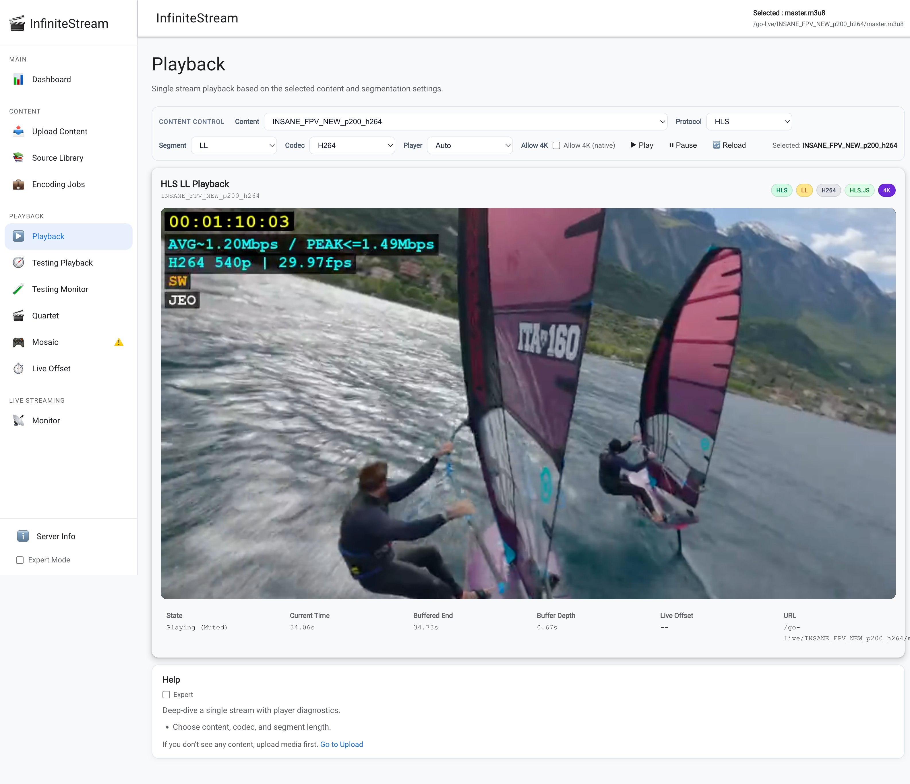 | **Mosaic** — multi-tile comparison 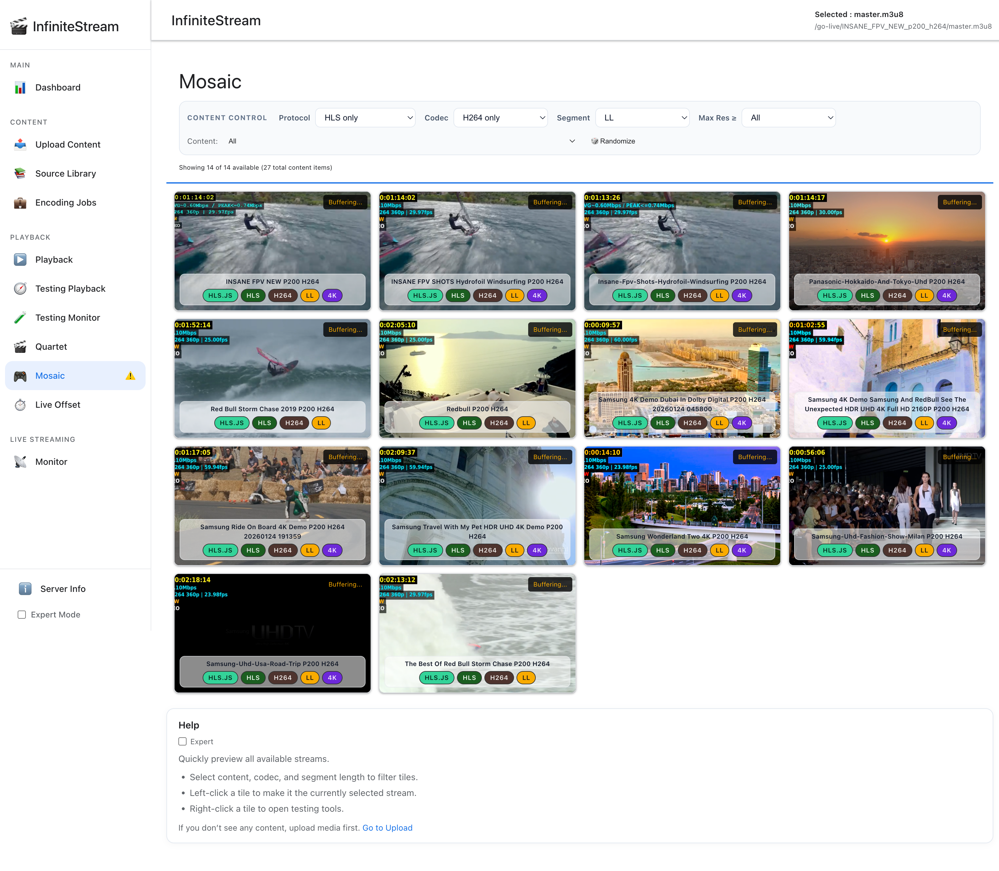 |
| **Source Library** — content intake  | **Upload Content** 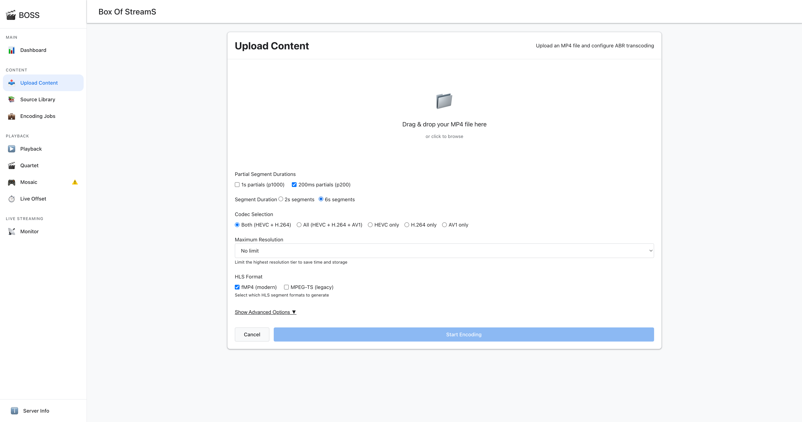 |
| **Encoding Jobs**  | **Live Offset** *(alpha)* — cross-variant comparison  |
| **iPad — home**  | **iPad — Settings → Advanced** with destructive Reset All Settings  |

---

## Documentation index

**Reference:**
- [`docs/ARCHITECTURE.md`](docs/ARCHITECTURE.md) — services, routing, port map, request flow
- [`docs/API.md`](docs/API.md) — HTTP endpoints across go-live, go-upload, go-proxy
- [`docs/FAULT_INJECTION.md`](docs/FAULT_INJECTION.md) — full fault and shaping reference
- [`docs/DEPLOYMENT.md`](docs/DEPLOYMENT.md) — k3s, release tagging, GHCR publishing
- [`docs/TROUBLESHOOTING.md`](docs/TROUBLESHOOTING.md) — common issues and fixes
- [`PRD.md`](PRD.md) — product behavior source of truth
- [`CONTRIBUTING.md`](CONTRIBUTING.md) — development workflow

**Encoding:**
- [`generate_abr/README.md`](generate_abr/README.md), [`generate_abr/QUICKSTART.md`](generate_abr/QUICKSTART.md)
- [`docs/CLOUD_ENCODING.md`](docs/CLOUD_ENCODING.md) — AWS EC2 spot offload
- [`generate_abr/HARDWARE_ENCODING_QUICKREF.md`](generate_abr/HARDWARE_ENCODING_QUICKREF.md)
- [`generate_abr/PACKAGER_COMPARISON.md`](generate_abr/PACKAGER_COMPARISON.md), [`generate_abr/DASH_PACKAGING_COMPARISON.md`](generate_abr/DASH_PACKAGING_COMPARISON.md)

**Subsystems:**
- [`go-live/IMPLEMENTATION_SUMMARY.md`](go-live/IMPLEMENTATION_SUMMARY.md), [`go-live/PLAN.md`](go-live/PLAN.md)
- [`analytics/README.md`](analytics/README.md) — analytics sidecar (ClickHouse + Grafana + replay mode)
- [`tests/integration/README.md`](tests/integration/README.md), [`tests/integration/PLAYER_CHARACTERIZATION_PYTEST.md`](tests/integration/PLAYER_CHARACTERIZATION_PYTEST.md)

---

## AI No-Code note

This project is primarily an **AI No-Code** build. The Go services and web dashboard were generated using Codex / OpenCode, GitHub Copilot, and Claude Code, with human direction and iterative testing.

## License

See [`LICENSE`](LICENSE) for attribution, internal-use, and redistribution terms.
