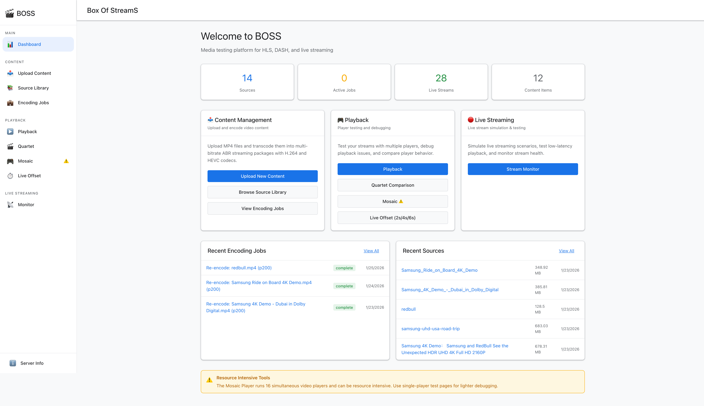
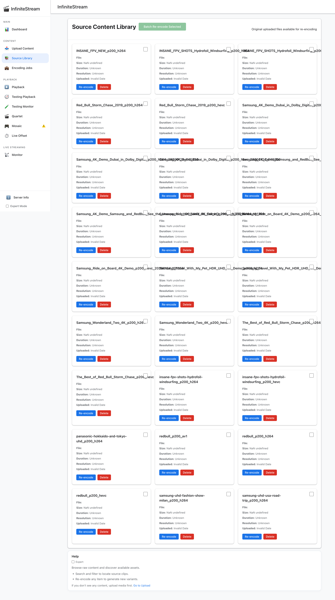
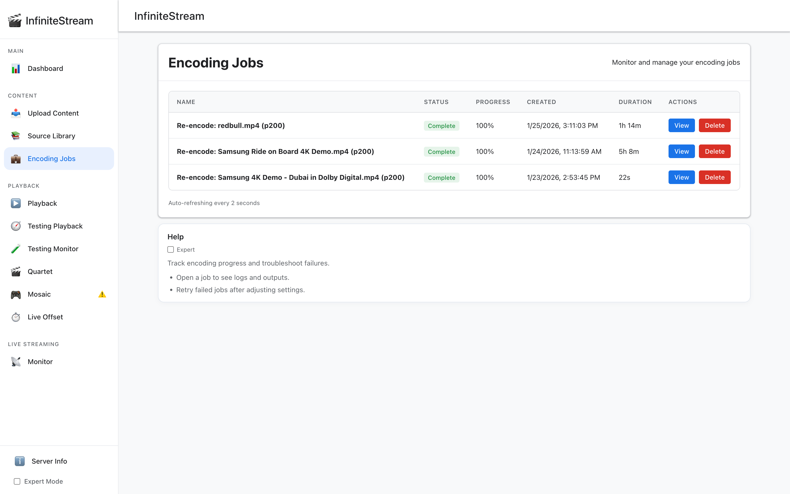

# InfiniteStream

A Docker-based HLS/DASH test server for video players. Generates LL-HLS and LL-DASH streams (plus 2s and 6s segment variants) from short VOD content on a shared clock, and lets you inject deterministic, streaming-aware failures — HTTP errors, hung responses, corrupted segments, transport drops, bandwidth limits — on a per-session basis so player bugs become reproducible.

Built for player QA, SDK development, and side-by-side comparison across HLS.js, Shaka, Video.js, native, iOS/tvOS, Android, and Roku. **Not** a production streaming origin.

Everything is driven by a REST API (the dashboard is a thin client over it), so every fault, every shaping change, every session control available in the UI is also available to test scripts and CI.



---

## Why you might want this

Player bugs are usually environmental — a network blip, a truncated segment, a slow manifest, a discontinuity the player didn't handle. Reproducing them is the hard part of player QA. Existing options each fall short:

- **Public test streams** (Apple samples, DASH-IF vectors, Bitmovin demos) aren't deterministic, don't loop cleanly, and can't fail on command.
- **Production origins** (Wowza, AWS Elemental, Unified Streaming) are built to *serve* real viewers, not to misbehave on purpose.
- **DIY stacks** (ffmpeg + nginx-vod or nginx-rtmp) take days to wire up and don't give you LL-HLS and LL-DASH from the same clock, let alone a fault-injection UI.
- **Generic chaos tools** (toxiproxy, `tc` alone, Chaos Mesh) are protocol-agnostic — they don't understand segments, playlists, or manifests, so the failures they create aren't meaningful at the streaming layer.
- **Man-in-the-middle proxies** (Charles, mitmproxy) work per-request and per-operator; they don't script repeatable schedules across runs or isolate concurrent testers.

**What makes InfiniteStream different:**

- **Deterministic looping live.** The sliding window moves on a stable clock and wraps on loop boundaries. The same run produces the same timing.
- **All variants from one worker.** LL-HLS, LL-DASH, 2s, and 6s segment variants are generated from a single per-content worker on a shared clock, so cross-protocol comparisons are apples-to-apples.
- **Streaming-aware fault injection.** Inject HTTP errors, hangs, and payload corruption at the segment, playlist, or manifest layer — not just generic TCP faults.
- **Master-playlist manipulation.** Rewrite the HLS master on the fly — strip CODEC / AVERAGE-BANDWIDTH, overstate BANDWIDTH, allowlist specific rungs, change the live hold-back offset. Explore how ladder shape and optional HLS attributes affect startup, ABR, and live-edge latency **without re-encoding**.
- **Transport faults too.** Port-level DROP/REJECT via nftables, rate shaping via `tc`, composable with HTTP-layer faults.
- **Per-session isolation.** Each browser session binds to a dedicated proxy port via `player_id`, so concurrent testers don't collide.
- **Session grouping for differential testing.** Link two or more independent sessions so fault injection and network shaping apply to all of them simultaneously, while everything else (player engine, codec, live offset, platform, ladder constraints) stays independent per session. One bandwidth collapse, two `live_offset` values, instant apples-to-apples comparison of which setting rebuffers. Or iOS vs Android reacting to the exact same throughput curve. See [Session grouping](#session-grouping-differential-testing).
- **Side-by-side comparison UI.** Mosaic and quartet views for watching multiple players or encodings against the same source simultaneously.
- **Accessible to non-programmers.** The whole surface is a web UI — click a fault type, drag a throttle slider, flip a Content-tab toggle, watch the bitrate / buffer / FPS charts react in real time. No Python addons, no YAML, no CLI. A QA analyst, a producer, or a support engineer can run real experiments and see cause-and-effect without writing any code.
- **Everything is a REST API.** No UI-only controls — anything a tester can do, a CI job can do.

**Use cases:**

- Regression-test a player release against a known fault schedule before shipping.
- Reproduce a customer-reported stall by replaying the exact fault sequence.
- Compare HLS.js vs Shaka vs Video.js vs native on identical content under identical faults.
- **Differential testing via session grouping.** Link N independent sessions so one fault or throughput change hits all of them at the same moment — while each session keeps its own player, platform, codec, ladder, or live-offset. See [Session grouping](#session-grouping-differential-testing).
- Validate loop-boundary and discontinuity handling.
- Characterize a player's ABR algorithm under controlled bandwidth steps.
- Pre-validate ladder and HLS parameter decisions ("what if we dropped the 4K rung?", "what if we removed AVERAGE-BANDWIDTH?") without re-encoding.
- Smoke-test a new encoding ladder before promoting to staging.

**Comparison to alternatives:**

| Tool / approach | Good at | Why InfiniteStream instead |
|---|---|---|
| Public test streams (Apple, DASH-IF, Bitmovin demos) | Quick playback sanity checks | Not deterministic; no failure injection; no looping on your schedule |
| Production origins (Wowza, AWS Elemental, Unified Streaming) | Serving real viewers | Heavy, costly; not built for faults or side-by-side QA |
| FFmpeg + nginx-rtmp / nginx-vod (DIY) | Full control of the stack | Days of setup; no shared-clock LL-HLS + LL-DASH; no fault UI |
| Shaka Streamer | Packaging pipelines | Not a live test server; no looping, no faults, no dashboard |
| toxiproxy, `tc`, Chaos Mesh | Generic network faults | Protocol-agnostic — no awareness of segments, partials, playlists |
| Charles, mitmproxy | Per-request rewriting | Manual, per-operator; not scripted or repeatable across runs |
| mediamtx, SRS, OvenMediaEngine | Live ingest and serving | Not looping-VOD focused; not QA-focused; no fault injection |

**When not to use it:**

- You need a production streaming origin.
- You need full standards conformance on every LL-HLS / LL-DASH edge case (see [`PRD.md`](PRD.md) for the list of known limitations).
- You need DRM.
- You need scale beyond a handful of concurrent test sessions.

---

## Quick start

### Prerequisites

- **Docker** (and Docker Compose).
- A **media directory** on the host (`CONTENT_DIR`) for source files and encoded output. It will be mounted into the container as `/media`.
- **TLS certificates** in `$CONTENT_DIR/certs/`. Self-signed certs are auto-generated on first startup if none exist. To provide your own, drop `localhost.pem` and `localhost-key.pem` into `$CONTENT_DIR/certs/` before starting.

### Start it

```bash
git clone https://github.com/jonathaneoliver/infinite-streaming.git
cd infinite-streaming

cp .env.example .env       # edit CONTENT_DIR
docker compose up -d       # first run builds the image
```

Open **http://localhost:30000/** in a browser. That's the dashboard — everything else happens there.

Other deployment options (pre-built images, single container, k3s) are in [Advanced deployment](#advanced-deployment) at the bottom.

---

## Your first session (web player walkthrough)

All of the testing features are accessible through the built-in web dashboard. A common first pass:

1. **Load some content.** Open the dashboard → **Upload Content**, pick a video and encoding options, and submit. Or copy a file straight into `$CONTENT_DIR/originals/` and hit refresh on the **Source Library** page.

2. **Watch it play.** Open **Playback**, pick a protocol (HLS / DASH), segment duration (LL / 2s / 6s), codec, and player engine (HLS.js / Shaka / Video.js / Native / Auto). The player starts immediately.

3. **Open a Mosaic comparison.** **Mosaic (Grid)** shows multiple tiles filtered by protocol / codec / segment, all playing the same source, all in sync. Useful for spotting per-player differences at a glance.

4. **Open a Testing Session.** Right-click any tile in Mosaic → **Open in Testing Window**. The testing page binds your browser session to a dedicated proxy port, so failures and shaping you configure here only affect *your* session.

5. **Break things on purpose.** Inside the Testing Session card:
   - **Fault Injection → Segment / Manifest / Master tabs** — inject 404s, timeouts, hangs, corrupted payloads on a repeatable schedule.
   - **Fault Injection → Transport tab** — drop or RST the port via nftables.
   - **Fault Injection → Content tab** — rewrite the HLS master (strip CODECs, hide rungs, overstate bandwidth, change live offset).
   - **Network Shaping** — delay / loss / throughput sliders or scripted patterns (square wave, ramp up/down, pyramid).

6. **Watch the reaction.** The **Bitrate Chart** stacks three time-series charts (bitrate, buffer depth, FPS) on a shared 10-minute timeline. A bandwidth dip, buffer drop, and FPS stutter all line up visually, so root-causing is a matter of eyeballing the three charts together.

7. **Group two sessions for a side-by-side.** Open a second Testing Session for the same source but with a different player engine, live offset, or device — then link the two as a group. From then on, any fault or throughput change applies to **both** simultaneously, while each session keeps its own player config. See [Session grouping](#session-grouping-differential-testing) below for the canonical use cases.

That walkthrough exercises the majority of the system. The sections below describe each part in depth.

---

## Dashboard pages

- **Playback** — single-stream view with protocol, codec, segment, and player selection. Auto-plays on change.
- **Mosaic (Grid)** — multi-tile view with filters (protocol / codec / segment). Right-click a tile to open a Testing Session.
- **Quartet** — four-panel side-by-side comparison across encodings or players.
- **Live Offset** — compares live offset, buffer depth, and seekable ranges across variants.
- **Testing Session** — per-session failure injection, traffic shaping, content manipulation, metrics charts. See below.
- **Go-Monitor** — active workers, request counts, last-request time, idle timeout, tick timings.
- **Upload Content** — web upload + encoding job tracking.
- **Source Library** — list of `$CONTENT_DIR/originals/`. Click to kick re-encodes.

Selected content and URL persist across pages in `localStorage` (`ismSelected*`).

---

## Testing session in depth


Open directly if you don't want to come from Mosaic:

```
http://localhost:30000/dashboard/testing-session.html?player_id=<uuid>&url=<encoded-stream-url>
```

The `player_id` is required. go-proxy uses it to allocate a session-specific port (`30181..30881`) so that failure injection and shaping stay scoped to *your* session.

### Controls (top of the card)

- **Retry Fetch** — re-issue the current stream request without resetting the player.
- **Restart Playback** — destroy and rebuild the player, then reload the URL.
- **Reload Page** — full page reload with current query params.
- **Player selector** — HLS.js / Shaka / Video.js / Native / Auto.

### Failure injection (per request kind)

The Fault Injection card has separate tabs for **Segment**, **Manifest**, **Master**, **Transport**, and **Content**. The first three share the same controls:

- **Failure Type** (must be non-`none` to activate).
- **Units**: Requests / Seconds / Failures-per-Second.
- **Consecutive**: how wide the fault window is.
- **Frequency**: spacing between fault windows.

Changes auto-save. The full fault matrix (status codes, socket misbehavior, corruption) is in [`docs/FAULT_INJECTION.md`](docs/FAULT_INJECTION.md).

### Transport faults (per session port)

- **Fault Type**: None / Drop / Reject (via nftables).
- **Units**: Seconds or Packets / Seconds.
- **Consecutive**: duration (seconds mode) or packet threshold (packets mode).
- **Frequency (secs)**: cycle spacing. `0` means one-shot.
- **Counters**: UI shows current/last `Drop pkts` and `Reject pkts`.

Linux-only (macOS Docker Desktop can't do this).

### Network Shaping (per session)

- **Delay / Loss / Throughput** sliders — steady-state shaping (0–250 ms, 0–10%, 0–50 Mbps). Throughput is disabled when a pattern is active.
- **Pattern mode**: `sliders` (static), `square_wave`, `ramp_up`, `ramp_down`, `pyramid`. Non-`sliders` modes drive throughput through a scripted sequence of steps.
- **Step duration**: `6s` / `12s` / `18s` / `24s` — how long each pattern step holds.
- **Margin**: `Exact` / `+10%` / `+25%` / `+50%` — headroom added on top of each ladder bitrate when picking preset rates.
- **Throughput presets** are generated from the current manifest's variants (video + audio, deduped). Effective rate:
  `shaping_mbps = variant_mbps × (1 + margin_pct/100) + overhead_mbps`
  where `overhead_mbps` is computed from the audio playlist bandwidth plus a fixed `0.05 Mbps` playlist allowance. Presets below the lowest video variant (stall-risk threshold) are flagged.

### Content manipulation (HLS master rewriting)

The **Content** tab rewrites the HLS master playlist on the fly — no re-encoding. A fast feedback loop for testing ladder decisions and optional HLS attribute choices.

| Control | Effect | Typical impact |
|---|---|---|
| **Strip CODEC** | Remove `CODECS=` from `EXT-X-STREAM-INF` | Players can't do "chunkless prepare" — longer startup, extra probing fetches |
| **Strip AVERAGE-BANDWIDTH** | Remove `AVERAGE-BANDWIDTH=` | Players that weight average over peak may pick a different initial rung |
| **Overstate Bandwidth** | Inflate `BANDWIDTH` by 10% | Simulates over-conservative encoder declaration; players may sit on lower rungs |
| **Allowed variants** | Allowlist specific rungs — others removed | Sparse / top-heavy / single-rung ladder experiments |
| **Live offset** | `None` / `6s` / `18s` / `24s` hold-back hints | Trade live-edge latency vs rebuffer risk on jitter |

HLS only; DASH is a placeholder. Two-phase: play once to populate the variant list, then replay with the same `player_id`. Full reference in [`docs/FAULT_INJECTION.md`](docs/FAULT_INJECTION.md#manifest-content-manipulation).

### Bitrate chart (with buffer depth and FPS)

The session card has a collapsible **Bitrate Chart** that stacks up to three time-series charts sharing a 10-minute rolling window and unified zoom/pan. Legend entries toggle series, scroll zooms, drag pans, `⏸` pauses live updates.

- **Bitrate chart** — up to ten series:
  - **Server metrics**: `mbps_shaper_rate` (100 ms), `mbps_shaper_avg` (6 s rolling), `mbps_transfer_rate` (250 ms, byte-gated), `mbps_transfer_complete` (per segment). See the [Metrics reference](#metrics-reference) below.
  - **Player metrics**: `Player avg_network_bitrate` (averaged ABR bandwidth estimate — iOS `observedBitrate`, Android `DefaultBandwidthMeter`), `Player network_bitrate` (short-window instantaneous throughput — iOS only, from LocalHTTPProxy wire-byte accounting), `Rendition` (bitrate of the current playing variant).
  - **Reference lines**: `Limit` (shaping ceiling, stepped when a pattern is active), `Server Rendition` (what the server believes it delivered), one line per ladder `Variant` (hidden by default).
  - **Events**: `STALL` and `RESTART` markers annotate player stalls and restarts.
  - **Y-axis**: `Auto` or fixed `5 / 10 / 20 / 30 / 40 / 50` Mbps — pin the scale when comparing two sessions side by side.
- **Buffer depth chart** — player `buffered` TimeRanges (`player_metrics_buffer_depth_s`), auto-scaled 5–60 s.
- **FPS chart** — rendered and dropped frames/s from `player_metrics_frames_displayed` / `_dropped_frames`, 2 s sliding window, exponential smoothing (α = 0.15). Series: `FPS (smoothed)`, `Low FPS` (red below threshold), `FPS Baseline` (75th percentile), `Low Threshold` (`0.75 × baseline`), `Dropped Frames/s` (right Y-axis).

Buffer and FPS charts render when `showBufferDepthChart: true` on the session. All three share a timeline, so a bandwidth dip lines up visually with its buffer/FPS impact.

---

## Session grouping (differential testing)

Link two or more independent Testing Sessions into a **group**. Faults and network shaping applied to any group member are applied to **all** members simultaneously — while everything else stays independent per session. This is the single highest-leverage feature for *differential* testing: change exactly one variable and watch several targets react to an identical stimulus.

### What propagates vs what stays independent

| Propagates to all group members | Stays per-session |
|---|---|
| HTTP fault configuration (segment / manifest / master — type, mode, consecutive, frequency, URL allowlist) | Player engine (HLS.js / Shaka / Video.js / Native) |
| Transport faults (DROP / REJECT, timing) | Stream URL (protocol / codec / segment duration) |
| Network shaping — delay, loss, throughput, pattern mode, step duration, margin | Content-tab manipulations (strip CODEC, allowed variants, live offset, etc.) |
| Shaping patterns (square wave, ramps, pyramid) and their step schedules | Player selector and URL parameters |

Max 10 sessions per group. Endpoints: `POST /api/session-group/link`, `POST /api/session-group/unlink`, `GET /api/session-group/{groupId}` — see [`docs/FAULT_INJECTION.md`](docs/FAULT_INJECTION.md#session-grouping).

### Canonical use cases

- **Same stream, two live offsets.** Session A at `live_offset=6s`, session B at `live_offset=24s`. Apply a 3-second throughput collapse to the group. A rebuffers, B absorbs it — now you know exactly how much headroom the larger offset is buying you.
- **iOS vs Android under identical conditions.** Open one testing window driving an iOS simulator, another driving the Android player, group them, and drive a `ramp_down` pattern. The Bitrate / Buffer / FPS charts side by side show how each platform's ABR algorithm responds to the same wire-rate curve, with zero variance from network timing.
- **HLS.js vs Shaka on the same packet-loss schedule.** One click, two engines, identical 2% loss + 80 ms delay — does one rebuffer and the other ride it out?
- **H.264 vs HEVC under identical throttle.** Same variants on the ladder, different codec, grouped session — how does each codec's bitrate-for-quality affect rebuffer frequency when throughput drops below the 720p rung?
- **Sparse ladder vs full ladder.** Drop rungs with the Content tab's `Allowed variants` allowlist and compare. This matters most when the gaps are in the **low or middle** of the ladder — a player with only 360p and 4K and no steps in between has nowhere to land when throughput drops through that gap. On a choppy network the ABR logic will overshoot or undershoot, and the player can stall or thrash between the two available rungs instead of glide-downshifting. Group a full-ladder session against a gap-ladder session, drive `ramp_down` with oscillation, and watch the gap-ladder session rebuffer while the full-ladder one rides it out. Critical for validating that your production ladder actually survives poorly-behaving networks, not just smooth downshifts.
- **Same player, different Content-tab settings.** Identical engine, identical stream, grouped — but A has `Strip CODEC` on and B doesn't. Watch startup time diverge under the same network conditions.

The pattern is always: **change one variable per session, apply the same fault or shaping change to all of them, compare charts side by side.** The Bitrate / Buffer / FPS charts share a timeline across sessions, so you see effect alignment by eye.

---

## Third-party players

The Testing Session flow isn't limited to the built-in browser players. Any HTTP client — a native iOS/tvOS/Android app, a Roku channel, a set-top-box player, a CI harness — can be the video engine inside a session, get the same faults and shaping applied to it, and optionally stream metrics back into the dashboard's charts.

### The easy way: grab a session URL from Mosaic

Inside the dashboard, right-click any tile in **Mosaic (Grid)** → **Open in Testing Window**. That builds the session URL:

```
http://<host>:30000/dashboard/testing-session.html?url=<stream-url>&player_id=<uuid>&nav=1
```

For 3rd-party integrations you want the `player_id` and `url` values — those are the only two pieces of state a session needs. Paste the stream URL into your player and use the `player_id` on everything described below.

### Programmatic integration pattern

A native app integrates in four steps, all plain HTTP:

1. **List content.** `GET /api/content` returns the encoded library — content names, protocol flags (`has_hls` / `has_dash`), codec metadata. Stream URLs are **not** embedded in the response; you build them from the content name.

2. **Generate a `player_id`.** Any stable string unique to your session — a UUID, `"roku_<timestamp>"`, `"android-rig-03"`. Reuse the same id across the session's lifetime.

3. **Build the stream URL and play it.** Append `?player_id=<id>` to the manifest path:

   ```
   http://<host>:30081/go-live/<content>/master.m3u8?player_id=<id>       # HLS LL
   http://<host>:30081/go-live/<content>/master_2s.m3u8?player_id=<id>    # HLS 2s
   http://<host>:30081/go-live/<content>/master_6s.m3u8?player_id=<id>    # HLS 6s
   http://<host>:30081/go-live/<content>/manifest.mpd?player_id=<id>      # LL-DASH
   ```

   The proxy allocates a dedicated session port on first request and responds with `302` to the allocated port (e.g. `30081` → `30281`). **Follow the redirect** — all subsequent segment and playlist requests must stay on that port so faults and shaping apply. Every HLS.js/Shaka/AVPlayer/ExoPlayer/Roku player handles 302 redirects natively; this is zero work for the client.

4. **Optional: subscribe to session updates.** Open a Server-Sent Events stream at `GET /api/sessions/stream` to receive live updates when the dashboard operator changes faults, shaping, or group membership affecting your session. The iOS app uses this to mirror the operator's actions into its own testing UI.

That's it. The app is now a first-class Testing Session — any operator who opens the dashboard sees the session appear in the session list and can inject faults / shape bandwidth / group it alongside other sessions.

### Reporting metrics back (optional but recommended)

To make your 3rd-party player show up on the **Bitrate / Buffer / FPS charts** alongside the built-in web players, `POST /api/session/{player_id}/metrics` periodically with a `set` payload:

```json
{
  "set": {
    "player_metrics_video_bitrate_mbps": 4.2,
    "player_metrics_avg_network_bitrate_mbps": 5.1,
    "player_metrics_network_bitrate_mbps": 4.9,
    "player_metrics_buffer_depth_s": 18.4,
    "player_metrics_frames_displayed": 12345,
    "player_metrics_dropped_frames": 7,
    "player_metrics_last_event": "playing",
    "player_metrics_loop_count_player": 2,
    "player_metrics_profile_shift_count": 4
  }
}
```

Post cadence: 1–2 Hz is fine. The endpoint doesn't bump the session's control revision (it's observational data), so you won't fight with the operator's configuration changes. Report what your platform can measure — any subset is fine.

The full field catalogue and payload reference is in [`docs/API.md`](docs/API.md#go-proxy-sessions--faults).

### What the bundled clients do

The iOS, Android, and Roku apps in this repo are reference implementations of the pattern above:

| App | Content list | URL build | Session redirect | SSE | Metrics |
|---|:---:|:---:|:---:|:---:|:---:|
| [`apple/InfiniteStreamPlayer/`](apple/InfiniteStreamPlayer/) | yes (`/api/content`) | `?player_id=UUID` | auto-follow | yes | yes |
| [`android/InfiniteStreamPlayer/`](android/InfiniteStreamPlayer/) | yes (`/api/content`) | `?player_id=UUID` | auto-follow (ExoPlayer) | — | — |
| [`roku/InfiniteStreamPlayer/`](roku/InfiniteStreamPlayer/) | yes (`/api/content`) | `?player_id=roku_<ts>` | auto-follow | — | — |

Point at any of them as a starting template for a new platform.

---

## How it works

### Services (all run inside one Docker container)

| Service | Port | Role |
|---|---|---|
| `go-live` | 8010 | LL-HLS + LL-DASH generator (2s / 6s / LL segment variants) |
| `go-upload` | 8003 | Upload API, encoding job orchestration, content discovery |
| `go-proxy` | 30081 (+ per-session ports) | Failure injection, traffic shaping, SSE session stream |
| `nginx` | 30000 | Routing, static dashboard |
| `memcached` | 11211 | Session state (internal) |

### Live stream generation

- **On-demand**: the first request for a piece of content starts a per-content worker.
- **Single worker, shared clock**: each worker generates all HLS + DASH manifests (LL + 2s + 6s) in sync.
- **Low-latency**: LL-HLS and LL-DASH update on partial boundaries (default 200 ms).
- **Segment variants**: 2s and 6s update on their segment boundaries only.
- **Sliding window**: fixed (e.g. 36 s) that moves forward and wraps on loop boundaries.
- **Auto shutdown**: workers stop after an idle timeout when no requests are active.

### Host filesystem & content

Host-mounted volume at `/media` inside the container:

- `/media/originals/` — source files (MP4, MOV, etc.)
- `/media/dynamic_content/{content}/` — encoded outputs
- `/media/certs/` — TLS certs (auto-generated if missing)

Three ways to add content:

- **Upload via the dashboard.** Open **Upload Content**, pick a file and encoding options. The server writes the source to `/media/originals/` and the encoded ladder to `/media/dynamic_content/`.
- **Drop a source file in and encode from the UI.** Copy into `$CONTENT_DIR/originals/`, refresh **Source Library**, and trigger an encode from the UI.
- **Drop pre-encoded ladders in directly.** If you've already run the pipeline offline (locally or on a build machine), copy the whole `{content}/` directory into `$CONTENT_DIR/dynamic_content/`. It appears in the dashboard immediately — no import step.

To encode outside the dashboard (offline, in CI, or on a build box):

- Run the pipeline locally with [`generate_abr/create_abr_ladder.sh`](generate_abr/README.md). See [`generate_abr/QUICKSTART.md`](generate_abr/QUICKSTART.md) for common invocations and [`generate_abr/HARDWARE_ENCODING_QUICKREF.md`](generate_abr/HARDWARE_ENCODING_QUICKREF.md) for hardware-accelerated encodes.
- Offload to AWS EC2 spot instances via [`docs/CLOUD_ENCODING.md`](docs/CLOUD_ENCODING.md) — the cloud runner produces the same `{content}_h264/` and `{content}_hevc/` directory layout, so the output drops straight into `/media/dynamic_content/`.

### Primary endpoints

**HLS:**
- `http://localhost:30000/go-live/{content}/master.m3u8` (LL)
- `http://localhost:30000/go-live/{content}/master_2s.m3u8`
- `http://localhost:30000/go-live/{content}/master_6s.m3u8`

**DASH:**
- `http://localhost:30000/go-live/{content}/manifest.mpd` (LL)
- `http://localhost:30000/go-live/{content}/manifest_2s.mpd`
- `http://localhost:30000/go-live/{content}/manifest_6s.mpd`

Full API (`/api/content`, `/api/jobs`, `/api/sessions/*`, `/api/nftables/*`, etc.) is in [`docs/API.md`](docs/API.md).

---

## Metrics reference

### Throughput metrics

| Metric | Update cadence | What it measures |
|---|---|---|
| `mbps_shaper_rate` | 100 ms | Instantaneous shaped rate during active queue drain (1 s contiguous backlog-active run) |
| `mbps_shaper_avg` | 100 ms | Rolling 6 s average of `mbps_shaper_rate` values |
| `mbps_transfer_rate` | 250 ms | Byte-change-gated rate during segment transfer, aligned to HTB burst edges. Reports at drain/refill boundaries |
| `mbps_transfer_complete` | per segment | Total bytes / total time for one completed segment transfer (backlog drained to 0) |

### Metric semantics

- **Limit value** (`nftables` shaping rate): configured ceiling for the session port; a control target, not a measured throughput.
- **Shaper metrics** (`mbps_shaper_rate`, `mbps_shaper_avg`): from TC class byte counters on the 100 ms updatePort loop. Only active when TC shaping is configured (backlog > 0). `shaper_rate` goes to 0 on drain; `shaper_avg` smooths across segments.
- **Transfer metrics** (`mbps_transfer_rate`, `mbps_transfer_complete`): from the 10 ms awaitSocketDrain goroutine. `transfer_rate` aligns to actual TC burst edges (250 ms min gap). `transfer_complete` is the ground-truth per-segment rate.
- **Player averaged bandwidth** (`player_metrics_avg_network_bitrate_mbps`): player-side averaged ABR estimate; slow-moving, model-based; intended for ladder analysis, initial variant pick, and comparison against shaper average. Populated by iOS (AVPlayer `observedBitrate`), Android (`DefaultBandwidthMeter.bitrateEstimate`), and browser players (HLS.js / Shaka / native) — i.e., the one signal every player can provide.
- **Player instantaneous bandwidth** (`player_metrics_network_bitrate_mbps`): short-window near-instantaneous wire throughput; reacts quickly to sudden rate drops. Requires per-request wire visibility, so currently iOS-only (via LocalHTTPProxy); null on clients without that plumbing.

Under steady conditions: `shaper_rate` and `transfer_rate` track near the configured limit; `transfer_complete` is the most trustworthy single number. The player averaged bandwidth broadly tracks wire metrics but is smoother; the instantaneous version catches rate drops fastest.

Implementation details (netlink counters, caching, scope of overhead inclusion) are in [`docs/ARCHITECTURE.md`](docs/ARCHITECTURE.md#wire-metric-implementation).

---

## Encoding pipeline

Driven by `generate_abr/create_abr_ladder.sh` (ffmpeg + Shaka Packager v3.4.2, bundled in the container).

Defaults: segment duration **6 s**, partial duration **200 ms**, GOP duration **1 s**.

See [`generate_abr/README.md`](generate_abr/README.md) for the pipeline, [`generate_abr/QUICKSTART.md`](generate_abr/QUICKSTART.md) for common commands, and [`docs/CLOUD_ENCODING.md`](docs/CLOUD_ENCODING.md) for offloading encodes to AWS EC2 spot instances.

---

## Known limitations

Common LL-HLS/LL-DASH features that are **not fully implemented**:

- Blocking playlist reload (`_HLS_msn`, `_HLS_part`) and skip logic (`_HLS_skip`)
- `#EXT-X-RENDITION-REPORT` and `#EXT-X-PRELOAD-HINT`
- Chunked CMAF transfer for LL-DASH partials

Full list in [`PRD.md`](PRD.md).

---

## Client apps

Native client apps for device testing:

- **iOS/tvOS** — SwiftUI app in [`apple/InfiniteStreamPlayer/`](apple/InfiniteStreamPlayer/)
- **Android** — [`android/InfiniteStreamPlayer/README.md`](android/InfiniteStreamPlayer/README.md)
- **Roku** — BrightScript channel in [`roku/InfiniteStreamPlayer/README.md`](roku/InfiniteStreamPlayer/README.md)

Each has its own README for platform-specific setup.

---

## Other ways to run it

Most users should stick with Docker Compose from the [Quick start](#quick-start). These variants are for specific scenarios.

### Docker run (single container, no compose)

```bash
export CONTENT_DIR=/path/to/your/media

docker run -d --name infinite-streaming \
  --cap-add NET_ADMIN --privileged \
  -p 30000:30000 \
  -p 30081:30081 \
  -p 30181:30181 -p 30281:30281 -p 30381:30381 -p 30481:30481 \
  -p 30581:30581 -p 30681:30681 -p 30781:30781 -p 30881:30881 \
  -v $CONTENT_DIR:/media \
  ghcr.io/jonathaneoliver/infinite-streaming:latest \
  /sbin/launch.sh 1
```

Ports 30181–30881 are the per-session proxy ports that testing sessions get redirected to. Without mapping them, `testing-session.html` works but segments never load because the allocated session port is unreachable from the host.

> **macOS / Docker Desktop note:** Network shaping (TC/nftables) works on Docker Desktop for Mac with `--cap-add NET_ADMIN`, but the TC stats polling (every 100ms per session) spawns processes through the Linux VM layer, which causes significantly higher CPU usage and fan noise compared to native Linux. This is a Docker Desktop VM overhead issue, not a code issue. For sustained testing with shaping, use a native Linux host.

### Pre-built images from GHCR (no source checkout)

```bash
mkdir infinite-streaming && cd infinite-streaming
curl -fsSL https://raw.githubusercontent.com/jonathaneoliver/infinite-streaming/main/docker-compose.ghcr.yml \
  -o docker-compose.yml
echo "CONTENT_DIR=/path/to/your/media" > .env
docker compose up -d
```

### k3s, release tagging, GHCR publishing

See [`docs/DEPLOYMENT.md`](docs/DEPLOYMENT.md) for running in a k3s cluster (release + dev side by side), pinning immutable release tags, and configuring GHCR publishing from a fork.

---

## Screenshots

Captured from the live dashboard; files live in [`screenshots/`](screenshots/).

| | |
|---|---|
| **Playback** — single-stream view  | **Mosaic** — multi-tile comparison  |
| **Source Library** — content intake  | **Upload Content**  |
| **Encoding Jobs**  | **Live Offset** — cross-variant comparison  |

---

## Documentation index

**Reference:**
- [`docs/ARCHITECTURE.md`](docs/ARCHITECTURE.md) — services, routing, port map, request flow
- [`docs/API.md`](docs/API.md) — HTTP endpoints across go-live, go-upload, go-proxy
- [`docs/FAULT_INJECTION.md`](docs/FAULT_INJECTION.md) — full fault and shaping reference
- [`docs/DEPLOYMENT.md`](docs/DEPLOYMENT.md) — k3s, release tagging, GHCR publishing
- [`docs/TROUBLESHOOTING.md`](docs/TROUBLESHOOTING.md) — common issues and fixes
- [`PRD.md`](PRD.md) — product behavior source of truth
- [`CONTRIBUTING.md`](CONTRIBUTING.md) — development workflow

**Encoding:**
- [`generate_abr/README.md`](generate_abr/README.md), [`generate_abr/QUICKSTART.md`](generate_abr/QUICKSTART.md)
- [`docs/CLOUD_ENCODING.md`](docs/CLOUD_ENCODING.md) — AWS EC2 spot offload
- [`generate_abr/HARDWARE_ENCODING_QUICKREF.md`](generate_abr/HARDWARE_ENCODING_QUICKREF.md)
- [`generate_abr/PACKAGER_COMPARISON.md`](generate_abr/PACKAGER_COMPARISON.md), [`generate_abr/DASH_PACKAGING_COMPARISON.md`](generate_abr/DASH_PACKAGING_COMPARISON.md)

**Subsystems:**
- [`go-live/IMPLEMENTATION_SUMMARY.md`](go-live/IMPLEMENTATION_SUMMARY.md), [`go-live/PLAN.md`](go-live/PLAN.md)
- [`tests/integration/README.md`](tests/integration/README.md), [`tests/integration/PLAYER_CHARACTERIZATION_PYTEST.md`](tests/integration/PLAYER_CHARACTERIZATION_PYTEST.md)

---

## AI No-Code note

This project is primarily an **AI No-Code** build. The Go services and web dashboard were generated using Codex / OpenCode, GitHub Copilot, and Claude Code, with human direction and iterative testing.

## License

See [`LICENSE`](LICENSE) for attribution, internal-use, and redistribution terms.
